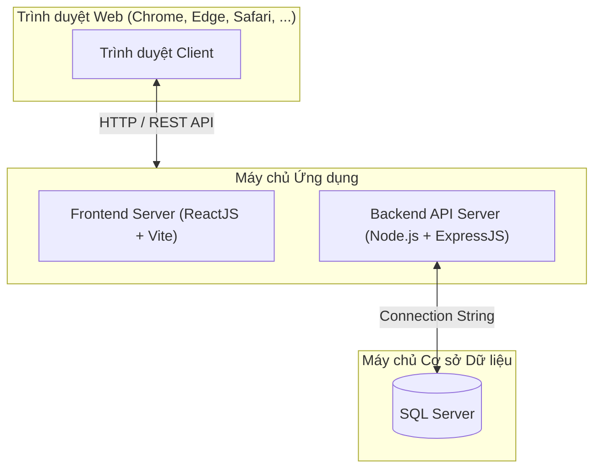
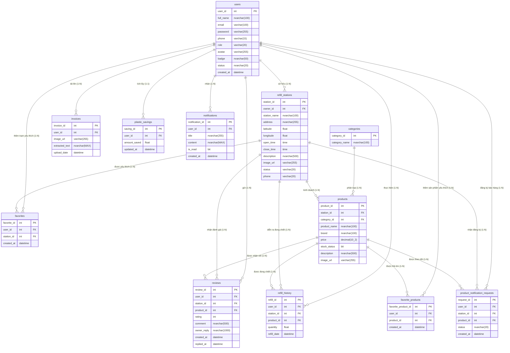

# ĐẠI HỌC LẠC HỒNG (LHU)
## KHOA CÔNG NGHỆ THÔNG TIN

***

# BÁO CÁO KẾT QUẢ NGHIÊN CỨU VÀ XÂY DỰNG HỆ THỐNG TÌM KIẾM VÀ QUẢN LÝ TRẠM REFILL "REFILLNEARBY"

**Môn học / Đề tài**: Đồ án Tốt nghiệp / Báo cáo Chuyên ngành Web
**Nhóm thực hiện**: Nhóm 06
**Sinh viên thực hiện**:
1. Huỳnh Thị Huyền Trâm - MSSV: 725000001
2. Trần Thị Hoài - MSSV: 725000818

**Giảng viên hướng dẫn**: *(Điền tên Thầy/Cô)*

*Biên Hòa, Năm 2026*

---

# MỤC LỤC

- [LỜI MỞ ĐẦU](#lời-mở-đầu)
  - [1.1. Lý do chọn đề tài](#11-lý-do-chọn-đề-tài)
  - [1.2. Mục tiêu nghiên cứu](#12-mục-tiêu-nghiên-cứu)
  - [1.3. Đối tượng và phạm vi nghiên cứu](#13-đối-tượng-và-phạm-vi-nghiên-cứu)
  - [1.4. Phương pháp nghiên cứu](#14-phương-pháp-nghiên-cứu)
- [Chương 1. TỔNG QUAN ĐỀ TÀI VÀ KHẢO SÁT HỆ THỐNG](#chương-1-tổng-quan-đề-tài-và-khảo-sát-hệ-thống)
  - [1.1. Đặt vấn đề và tình hình ứng dụng công nghệ trong bảo vệ môi trường & Refill](#11-đặt-vấn-đề-và-tình-hình-ứng-dụng-công-nghệ-trong-bảo-vệ-môi-trường--refill)
    - [1.1.1. Tình hình ứng dụng trong nước](#111-tình-hình-ứng-dụng-trong-nước)
    - [1.1.2. Tình hình ứng dụng ngoài nước](#112-tình-hình-ứng-dụng-ngoài-nước)
  - [1.2. Khảo sát các hệ thống/phần mềm liên quan](#12-khảo-sát-các-hệ-thốngphần-mềm-liên-quan)
    - [1.2.1. Khảo sát các hệ thống thương mại quốc tế](#121-khảo-sát-các-hệ-thống-thương-mại-quốc-tế)
    - [1.2.2. Khảo sát các nền tảng tổng hợp / bản đồ lối sống xanh nội địa](#122-khảo-sát-các-nền-tảng-tổng-hợp--bản-đồ-lối-sống-xanh-nội-địa)
  - [1.3. Phân tích ưu và nhược điểm của các hệ thống hiện có](#13-phân-tích-ưu-và-nhược-điểm-của-các-hệ-thống-hiện-có)
    - [1.3.1. Ưu điểm](#131-ưu-điểm)
    - [1.3.2. Khuyết điểm](#132-khuyết-điểm)
  - [1.4. Đề xuất giải pháp và kết luận](#14-đề-xuất-giải-pháp-và-kết-luận)
- [Chương 2. CƠ SỞ LÝ THUYẾT VÀ CÔNG NGHỆ SỬ DỤNG](#chương-2-cơ-sở-lý-thuyết-và-công-nghệ-sử-dụng)
  - [2.1. Cơ sở lý thuyết quản lý dự án và kiến trúc phần mềm](#21-cơ-sở-lý-thuyết-quản-lý-dự-án-và-kiến-trúc-phần-mềm)
    - [2.1.1. Phương pháp luận Agile/Scrum trong quản lý phát triển ứng dụng](#211-phương-pháp-luận-agilescrum-trong-quản-lý-phát-triển-ứng-dụng)
    - [2.1.2. Mô hình kiến trúc 3 lớp (Three-Tier Architecture)](#212-mô-hình-kiến-trúc-3-lớp-three-tier-architecture)
  - [2.2. Các công nghệ Backend & Cơ sở dữ liệu](#22-các-công-nghệ-backend--cơ-sở-dữ-liệu)
    - [2.2.1. Nền tảng Node.js và Framework ExpressJS](#221-nền-tảng-nodejs-và-framework-expressjs)
    - [2.2.2. Xác thực JWT (JSON Web Token) & Mã hóa Bcryptjs](#222-xác-thực-jwt-json-web-token--mã-hóa-bcryptjs)
    - [2.2.3. Hệ quản trị Cơ sở dữ liệu SQL Server 2022](#223-hệ-quản-trị-cơ-sở-dữ-liệu-sql-server-2022)
  - [2.3. Các công nghệ Frontend](#23-các-công-nghệ-frontend)
    - [2.3.1. Thư viện/Framework (ReactJS, Vite, React Router DOM)](#231-thư-việnframework-reactjs-vite-react-router-dom)
    - [2.3.2. Bản đồ định vị (React Leaflet) & Biểu đồ thống kê (Recharts)](#232-bản-đồ-định-vị-react-leaflet--biểu-đồ-thống-kê-recharts)
    - [2.3.3. Công nghệ nhận diện ký tự quang học OCR (Tesseract.js)](#233-công-nghệ-nhận-diện-ký-tự-quang-học-ocr-tesseractjs)
  - [2.4. Mô hình triển khai hệ thống (Deployment Architecture)](#24-mô-hình-triển-khai-hệ-thống-deployment-architecture)
- [Chương 3. PHÂN TÍCH VÀ THIẾT KẾ HỆ THỐNG](#chương-3-phân-tích-và-thiết-kế-hệ-thống)
  - [3.1. Xác định yêu cầu hệ thống](#31-xác-định-yêu-cầu-hệ-thống)
    - [3.1.1. Các tác nhân hệ thống (Actors)](#311-các-tác-nhân-hệ-thống-actors)
    - [3.1.2. Danh sách các chức năng nghiệp vụ](#312-danh-sách-các-chức-năng-nghiệp-vụ)
  - [3.2. Mô hình Use Case](#32-mô-hình-use-case)
    - [3.2.1. Biểu đồ Use Case Cấp 0 (Tổng quát hệ thống)](#321-biểu-đồ-use-case-cấp-0-tổng-quát-hệ-thống)
    - [3.2.2. Nhóm Use Case Khách hàng (User)](#322-nhóm-use-case-khách-hàng-user)
    - [3.2.3. Nhóm Use Case Chủ trạm (Owner)](#323-nhóm-use-case-chủ-trạm-owner)
    - [3.2.4. Nhóm Use Case Quản trị hệ thống (Admin)](#324-nhóm-use-case-quản-trị-hệ-thống-admin)
    - [3.2.5. Đặc tả Use Case cốt lõi](#325-đặc-tả-use-case-cốt-lõi)
  - [3.3. Biểu đồ hoạt động (Activity Diagram)](#33-biểu-đồ-hoạt-động-activity-diagram)
  - [3.4. Thiết kế Cơ sở dữ liệu](#34-thiết-kế-cơ-sở-dữ-liệu)
    - [3.4.1. Từ điển dữ liệu](#341-từ-điển-dữ-liệu)
    - [3.4.2. Mô hình thực thể liên kết (ERD)](#342-mô-hình-thực-thể-liên-kết-erd)
    - [3.4.3. Chuyển đổi sang Lược đồ quan hệ](#343-chuyển-đổi-sang-lược-đồ-quan-hệ)
    - [3.4.4. Đánh giá và xác định Dạng chuẩn](#344-đánh-giá-và-xác-định-dạng-chuẩn)
    - [3.4.5. Mô tả ràng buộc toàn vẹn](#345-mô-tả-ràng-buộc-toàn-vẹn)
- [Chương 4. TRIỂN KHAI ỨNG DỤNG HỆ THỐNG](#chương-4-triển-khai-ứng-dụng-hệ-thống)
  - [4.1. Kiến trúc mã nguồn](#41-kiến-trúc-mã-nguồn)
  - [4.2. Triển khai Module Tìm kiếm & Bản đồ Trạm Refill](#42-triển-khai-module-tìm-kiếm--bản-đồ-trạm-refill)
  - [4.3. Triển khai Module Chủ trạm Quản lý Trạm & Sản phẩm](#43-triển-khai-module-chủ-trạm-quản-lý-trạm--sản-phẩm)
  - [4.4. Triển khai Module OCR Hóa đơn & Thống kê Tiết kiệm Nhựa](#44-triển-khai-module-ocr-hóa-đơn--thống-kê-tiết-kiệm-nhựa)
  - [4.5. Triển khai Module Đánh giá, Yêu thích & Thông báo](#45-triển-khai-module-đánh-giá-yêu-thích--thông-báo)
  - [4.6. Triển khai Module Quản trị Hệ thống (Admin Dashboard)](#46-triển-khai-module-quản-trị-hệ-thống-admin-dashboard)
- [Chương 5. KIỂM THỬ, ĐÁNH GIÁ VÀ HƯỚNG PHÁT TRIỂN](#chương-5-kiểm-thử-đánh-giá-và-hướng-phát-triển)
  - [5.1. Kiểm thử hệ thống (Testing)](#51-kiểm-thử-hệ-thống-testing)
  - [5.2. Đánh giá kết quả đạt được](#52-đánh-giá-kết-quả-đạt-được)
  - [5.3. Hạn chế của hệ thống](#53-hạn-chế-của-hệ-thống)
  - [5.4. Định hướng phát triển tương lai](#54-định-hướng-phát-triển-tương-lai)
- [TÀI LIỆU THAM KHẢO](#tài-liệu-tham-khảo)

---

# LỜI MỞ ĐẦU

### 1.1. Lý do chọn đề tài
Trong kỷ nguyên hiện đại, ô nhiễm rác thải nhựa dùng một lần đã và đang trở thành một trong những khủng hoảng môi trường nghiêm trọng nhất toàn cầu. Hàng triệu tấn chai nhựa sinh hoạt (nước rửa chén, dầu gội, sữa tắm, chất tẩy rửa,...) bị thải ra môi trường mỗi năm, mất hàng trăm năm để phân hủy. Xu hướng **Refill** (tái sử dụng vỏ chai sẵn có để đong chiết lại sản phẩm) đã ra đời như một giải pháp thiết thực, nhân văn và mang lại giá trị bền vững cho cộng đồng.

Tuy nhiên, tại Việt Nam, mô hình Refill vẫn còn đối mặt với rào cản lớn: **người tiêu dùng thiếu thông tin về các trạm refill lân cận**, không biết trạm nào đang mở cửa, trạm có bán loại sản phẩm mình cần hay không, hoặc thiếu động lực theo dõi lượng nhựa mình đã tiết kiệm được. Về phía các chủ trạm refill nhỏ lẻ, họ thiếu công cụ công nghệ để quản lý danh mục hàng hóa, tiếp cận khách hàng tiềm năng và phản hồi đánh giá.

Xuất phát từ thực trạng đó, nhóm nghiên cứu đã lựa chọn đề tài **"Xây dựng hệ thống tìm kiếm và quản lý trạm Refill - RefillNearby"**. Đề tài giải quyết bài toán kết nối người dùng có lối sống xanh với các trạm refill thông qua ứng dụng Web hiện đại, tích hợp bản đồ số định vị, quét hóa đơn bằng công nghệ nhận diện chữ OCR (Tesseract.js) và trực quan hóa số liệu tiết kiệm nhựa.

### 1.2. Mục tiêu nghiên cứu
Mục tiêu cốt lõi của đề tài là xây dựng hệ thống **RefillNearby** dưới dạng ứng dụng web nhằm hỗ trợ người dùng tìm kiếm các trạm refill một cách nhanh chóng và thuận tiện, góp phần khuyến khích thói quen tiêu dùng xanh, giảm thiểu rác thải nhựa và nâng cao hiệu quả quản lý hoạt động của các trạm refill. Đồng thời, hệ thống cung cấp các công cụ quản lý và thống kê dành cho chủ trạm và quản trị viên, giúp việc vận hành hệ thống trở nên hiệu quả, chính xác và dễ dàng hơn.

- **Về mặt lý thuyết**: Nghiên cứu và áp dụng thành công kiến trúc phần mềm tiên tiến (mô hình 3 lớp Three-Tier / Clean Architecture) nhằm đảm bảo tính độc lập, dễ bảo trì và khả năng mở rộng của hệ thống. Đồng thời, vận dụng phương pháp quản lý dự án linh hoạt (Agile/Scrum) để đối ứng với sự thay đổi liên tục của các luồng nghiệp vụ.
- **Về mặt thực tiễn**: Xây dựng hoàn chỉnh một nền tảng Web App **RefillNearby** đáp ứng các chức năng nghiệp vụ bao gồm:
  1. Số hóa quy trình tìm kiếm trạm refill theo vị trí thực tế và hiển thị bản đồ định vị tương tác (React Leaflet).
  2. Số hóa danh mục sản phẩm đong chiết, cập nhật trạng thái còn/hết hàng theo thời gian thực và quản lý tương tác đánh giá từ khách hàng.
  3. **Tự động hóa trích xuất hóa đơn và gợi ý sản phẩm refill (OCR)**: Ứng dụng công nghệ nhận diện ký tự quang học (Tesseract.js OCR) đọc văn bản trên hóa đơn mua hàng (khi người dùng tải ảnh hoặc chụp ảnh), từ đó tự động phân tích và đối chiếu với cơ sở dữ liệu để **gợi ý các sản phẩm refill tương tự và trạm refill phù hợp**, khuyến khích thói quen tái đong chiết.
  4. Trực quan hóa số liệu thống kê lượng nhựa tiết kiệm (Plastic Savings Dashboard) và cung cấp công cụ quản trị tập trung dành cho Chủ trạm (Owner) và Quản trị viên (Admin).

### 1.3. Đối tượng và phạm vi nghiên cứu

#### 1.3.1. Đối tượng nghiên cứu
*Đối tượng nghiên cứu tập trung vào bản chất công nghệ, mô hình kiến trúc và các quy trình nghiệp vụ cốt lõi mà đề tài đi sâu phân tích và xây dựng:*
- **Mô hình kiến trúc & Phát triển phần mềm**: Kiến trúc ứng dụng Web 3 lớp (Three-Tier Architecture), thiết kế hệ thống RESTful API kết nối giữa Client (ReactJS) và Server (Node.js/ExpressJS).
- **Cơ sở dữ liệu quan hệ**: Phương pháp thiết kế và chuẩn hóa CSDL Microsoft SQL Server 2022 đạt các tiêu chuẩn dạng chuẩn 3NF; giải pháp xác thực phân quyền JWT (JSON Web Token) và băm mật khẩu bảo mật (`bcryptjs`).
- **Công nghệ không gian & Bản đồ số**: Thư viện React Leaflet, OpenStreetMap Tile Layer và kỹ thuật tính toán khoảng cách tọa độ địa lý (Latitude, Longitude) để lọc trạm refill theo vị trí thực tế.
- **Công nghệ nhận diện ký tự quang học (OCR)**: Thuật toán trích xuất văn bản từ hình ảnh bằng thư viện Tesseract.js trong bài toán đọc dữ liệu hóa đơn mua hàng.
- **Quy trình nghiệp vụ tiêu dùng xanh**: Quy trình phân tích hóa đơn mua sắm $\rightarrow$ đối chiếu CSDL $\rightarrow$ gợi ý sản phẩm/trạm refill tương tự, và thuật toán quy đổi lịch sử đong chiết thành số liệu kg nhựa tiết kiệm (`plastic_savings`).

#### 1.3.2. Phạm vi nghiên cứu
*Phạm vi nghiên cứu xác định rõ ranh giới về đối tượng sử dụng, các phân hệ chức năng thực hiện và các giới hạn không thuộc phạm vi đề tài:*
- **Phạm vi đối tượng sử dụng**:
  - Người tiêu dùng xanh (User/Customer), Chủ trạm đong chiết refill (Station Owner), và Quản trị viên hệ thống (Admin).
- **Phạm vi chức năng hệ thống**:
  - *Phân hệ Khách hàng*: Đăng ký/đăng nhập, tìm kiếm trạm refill trên bản đồ theo vị trí, lọc sản phẩm & trạng thái tồn kho, lưu yêu thích, gửi đánh giá, tải/chụp ảnh hóa đơn OCR để nhận gợi ý sản phẩm/trạm refill tương tự, xem biểu đồ nhựa tiết kiệm.
  - *Phân hệ Chủ trạm*: Đăng ký trạm mới, cập nhật tọa độ/địa chỉ/ảnh/giờ mở cửa, quản lý sản phẩm (thêm/sửa, cập nhật giá & trạng thái còn/hết hàng), phản hồi đánh giá.
  - *Phân hệ Quản trị*: Khóa/kích hoạt tài khoản người dùng, quản lý danh mục sản phẩm (`categories`), kiểm duyệt và quản lý toàn bộ các trạm refill.
- **Phạm vi không gian & dữ liệu thử nghiệm**:
  - Dữ liệu thử nghiệm tập trung vào các trạm refill tại khu vực Tỉnh Đồng Nai (Thành phố Biên Hòa) và các khu vực lân cận.
- **Giới hạn phạm vi (Những phần KHÔNG thực hiện trong đề tài)**:
  - Hệ thống **chưa** tích hợp cổng thanh toán trực tuyến (MoMo/VNPay).
  - **Chưa** xây dựng hệ thống quản lý giao hàng / vận chuyển (Delivery) và quản lý kế toán/doanh thu chuyên sâu cho cửa hàng.
  - Nền tảng phát triển dưới dạng **Web Application** (chưa xây dựng ứng dụng di động Mobile Native iOS/Android).

### 1.4. Phương pháp nghiên cứu
- **Phương pháp nghiên cứu tài liệu**: Tìm hiểu các thư viện React Leaflet, ExpressJS, SQL Server, Tesseract.js, Recharts, JWT.
- **Phương pháp phân tích & thiết kế hệ thống**: Sử dụng ngôn ngữ UML thiết kế sơ đồ Use Case, Activity Diagram; xây dựng Từ điển dữ liệu và sơ đồ ERD chuẩn hóa 3NF trong SQL Server.
- **Phương pháp lập trình thực nghiệm**: Phát triển theo mô hình Agile/Scrum, kiểm thử từng module chức năng trước khi đóng gói hoàn chỉnh.

---

# Chương 1. TỔNG QUAN ĐỀ TÀI VÀ KHẢO SÁT HỆ THỐNG

### 1.1. Đặt vấn đề và tình hình ứng dụng công nghệ trong bảo vệ môi trường & mô hình Refill

Trong bối cảnh biến đổi khí hậu và ô nhiễm môi trường toàn cầu ngày càng gia tăng, rác thải nhựa dùng một lần (single-use plastics) từ hoạt động sinh hoạt hàng ngày — như chai lọ chứa nước rửa chén, dầu gội, sữa tắm, nước lau sàn — đang tạo ra áp lực khổng lồ lên hệ sinh thái. Hàng triệu chai nhựa bị thải bỏ mỗi ngày dù vỏ chai hoàn toàn có khả năng tái sử dụng nhiều lần. Mô hình **Refill** (tái đong chiết sản phẩm vào vỏ chai cũ) ra đời như một giải pháp kinh tế tuần hoàn nhân văn, giảm thiểu rác thải nhựa ngay từ đầu nguồn.

Tuy nhiên, việc nhân rộng mô hình Refill đang gặp phải những "điểm nghẽn" lớn về mặt công nghệ và thông tin. Người tiêu dùng muốn thực hành lối sống xanh nhưng không biết xung quanh mình có trạm refill nào, trạm đang mở hay đóng cửa, hoặc trạm có bán đúng loại sản phẩm mình cần hay không. Trong khi đó, các chủ trạm refill nhỏ lẻ lại thiếu một nền tảng công nghệ chuyên biệt để quảng bá vị trí trạm, cập nhật danh mục hàng hóa và tương tác với khách hàng.

#### 1.1.1. Tình hình ứng dụng công nghệ trong nước
Tại Việt Nam, các phong trào sống xanh (Zero-Waste, Go Green) đang nhận được sự ủng hộ tích cực từ thế hệ trẻ và cộng đồng tại các thành phố lớn như TP. Hồ Chí Minh, Hà Nội, Đà Nẵng, Biên Hòa. Tuy nhiên, mức độ ứng dụng công nghệ thông tin trong mô hình Refill còn rất sơ khai:
- **Thông tin bị phân mảnh**: Danh sách các trạm refill chủ yếu được chia sẻ dưới dạng các bài viết tĩnh trên mạng xã hội (Facebook Groups, Instagram), bảng tính Excel hoặc bài báo mạng. Dữ liệu này thiếu tính năng định vị thời gian thực, không thể tìm kiếm theo bán kính khoảng cách địa lý.
- **Thiếu thông tin tồn kho thời gian thực**: Người dùng phải đến tận nơi hoặc gọi điện hỏi chủ trạm mới biết sản phẩm đó còn hàng hay hết hàng (`stock_status`), gây lãng phí thời gian và làm giảm trải nghiệm sống xanh.
- **Chưa có công cụ kết nối thói quen mua sắm**: Người tiêu dùng hàng ngày mua sắm các hóa mỹ phẩm tại siêu thị/cửa hàng tiện lợi vẫn tạo ra rác thải vỏ chai. Chưa có công cụ số nào hỗ trợ họ chụp/quét hóa đơn mua sắm để hệ thống nhận diện sản phẩm và tự động gợi ý: *"Lần sau bạn có thể refill sản phẩm tương tự tại trạm Refill A gần bạn nhất"*.

#### 1.1.2. Tình hình ứng dụng công nghệ ngoài nước
Trên thế giới, đặc biệt là tại Châu Âu và Bắc Mỹ, ngành công nghệ hỗ trợ bền vững (GreenTech / EcoTech) đã phát triển các nền tảng rất mạnh mẽ:
- **Refill App (City to Sea - Anh Quốc)**: Nền tảng bản đồ số kết nối hàng trăm nghìn điểm refill nước uống, thực phẩm và chất tẩy rửa trên khắp Vương Quốc Anh. Người dùng dễ dàng định vị trạm refill gần nhất qua GPS.
- **Algramo (Chile)**: Nền tảng bán hàng đong chiết thông minh kết hợp ứng dụng di động và cây đong chiết tự động. Hệ thống sử dụng mã QR/RFID gắn trên chai để theo dõi số lần refill và tính toán chính xác lượng nhựa tiết kiệm được.
- **Trashless / Loop (Mỹ & Châu Âu)**: Mô hình thương mại điện tử kết hợp tuần hoàn bao bì, cho phép giao hàng và thu hồi vỏ chai tận nhà.

*Đánh giá chung*: Mặc dù các ứng dụng quốc tế rất hiện đại, nhưng chúng không bao phủ dữ liệu tại Việt Nam, chưa hỗ trợ ngôn ngữ tiếng Việt và chưa tích hợp giải pháp trích xuất hóa đơn siêu thị Việt Nam (OCR) để gợi ý trạm refill phù hợp. Do đó, việc nghiên cứu và xây dựng nền tảng **RefillNearby** là một đòi hỏi cấp thiết, mang tính thực tiễn và tính khả thi cao.

### 1.2. Khảo sát các hệ thống/phần mềm liên quan

Để có cái nhìn khách quan và xác định đúng hướng đi đột phá cho đề tài, quá trình khảo sát được tiến hành trên hai nhóm hệ thống/nền tảng tiêu biểu đang vận hành trên thị trường:

#### 1.2.1. Khảo sát các hệ thống thương mại quốc tế
- **Refill App (City to Sea - Vương Quốc Anh)**: Nền tảng phi lợi nhuận lớn nhất thế giới kết nối người dùng với các điểm đong chiết nước uống và thực phẩm xanh qua bản đồ GPS trực quan, giúp định vị nhanh các điểm refill tại Châu Âu, tuy nhiên hệ thống chưa phục vụ dữ liệu tại Việt Nam và thiếu phân hệ quản lý tồn kho/giá bán chuyên sâu cho từng chủ trạm.
- **Algramo (Chile)**: Mô hình bán lẻ đong chiết thông minh kết hợp ứng dụng di động với cây bán hàng tự động qua công nghệ RFID/Mã QR trên vỏ chai tái chế để tự động tính toán lượng nhựa tiết kiệm, nhưng giải pháp này đòi hỏi chi phí đầu tư thiết bị phần cứng rất đắt đỏ, chưa phù hợp với mô hình các cửa hàng refill vừa và nhỏ tại Việt Nam.

#### 1.2.2. Khảo sát các nền tảng tổng hợp / ứng dụng địa phương tại Việt Nam
- **Bản đồ Sống Xanh (GreenMap / Các dự án phi lợi nhuận nội địa)**: Dự án bản đồ cộng đồng trên Google My Maps và Website tĩnh hỗ trợ tra cứu địa chỉ điểm xanh và trạm refill, tuy nhiên dữ liệu cập nhật thủ công, thiếu tính năng tương tác hai chiều, không theo dõi được trạng thái còn/hết hàng thời gian thực và không có công cụ quản trị cho chủ trạm.
- **Các hội nhóm cộng đồng sống xanh trên Mạng xã hội (Facebook Groups, Instagram, Zalo)**: Kênh truyền thông phổ biến kết nối người dùng với các shop refill độc lập qua bài viết và tin nhắn, nhưng thông tin bị phân mảnh nghiêm trọng, không thể tìm kiếm theo bán kính GPS thực tế và hoàn toàn thiếu các công cụ số hóa như OCR đọc hóa đơn hay biểu đồ thống kê nhựa tiết kiệm.

### 1.3. Phân tích ưu và nhược điểm của các hệ thống hiện có

Dựa trên kết quả khảo sát, nhóm nghiên cứu tổng hợp bảng so sánh mức độ đáp ứng các tính năng nghiệp vụ của các hệ thống hiện tại so với giải pháp **RefillNearby**:

*Bảng 1.1 - Bảng khảo sát và so sánh các hệ thống liên quan với hệ thống RefillNearby*
| STT | Tiêu chí so sánh / Chức năng | Refill App (Anh Quốc) | Algramo (Chile) | GreenMap / MXH (Việt Nam) | **RefillNearby (Đề tài)** |
| :---: | :--- | :---: | :---: | :---: | :---: |
| 1 | Định vị bản đồ GPS thời gian thực | ✅ Có | ✅ Có | ❌ Thủ công / Tĩnh | **✅ Tương tác (Leaflet)** |
| 2 | Quản lý sản phẩm & Trạng thái tồn kho | ❌ Không | ✅ Có (Cây bán tự động) | ❌ Không | **✅ Cập nhật thời gian thực** |
| 3 | Đọc hóa đơn siêu thị (OCR) & Gợi ý đong chiết | ❌ Không | ❌ Không (Dùng mã QR/RFID) | ❌ Không | **✅ Tesseract.js OCR** |
| 4 | Trực quan hóa thống kê nhựa tiết kiệm | ❌ Hạn chế | ✅ Có | ❌ Không | **✅ Biểu đồ Recharts** |
| 5 | Phân quyền Quản trị (User, Owner, Admin) | ❌ Không | ❌ Không | ❌ Không | **✅ Đầy đủ 3 vai trò** |
| 6 | Hỗ trợ dữ liệu & Tiếng Việt tại Việt Nam | ❌ Không | ❌ Không | ✅ Có | **✅ 100% Tiếng Việt** |

Dựa trên bảng so sánh trên, có thể rút ra những đánh giá chi tiết về ưu điểm và hạn chế cốt lõi như sau:

#### 1.3.1. Ưu điểm
- **Với nhóm hệ thống thương mại quốc tế (Refill App, Algramo)**: Rất mạnh về khía cạnh trải nghiệm người dùng như hiển thị bản đồ trực quan, định vị GPS chính xác, giao diện hiện đại và tích hợp công nghệ đong chiết tự động (RFID/QR), giúp nâng cao nhận thức cộng đồng và tính minh bạch trong việc giảm thiểu rác thải nhựa.
- **Với nhóm nền tảng nội địa (GreenMap, Mạng xã hội)**: Tính linh hoạt cao, tiếp cận nhanh chóng với cộng đồng người tiêu dùng xanh tại Việt Nam, chi phí triển khai truyền thông thấp và dễ dàng công bố thông tin các cửa hàng refill lên các kênh truyền thông sẵn có.

#### 1.3.2. Khuyết điểm (Hạn chế cốt lõi)
- **Thiếu phân hệ quản lý tồn kho và trạng thái hàng hóa thời gian thực**: Cả hai nhóm hệ thống trên đều không có kiến trúc cơ sở dữ liệu được thiết kế đặc thù để quản lý danh mục sản phẩm refill và cập nhật trạng thái còn/hết hàng (`stock_status`) của từng trạm theo thời gian thực, dẫn đến tình trạng người dùng đến nơi nhưng không mua được hàng.
- **Bỏ ngỏ khâu kết nối hóa đơn siêu thị và gợi ý tái đong chiết (OCR)**: Các hệ thống hiện tại không cung cấp công cụ tự động trích xuất thông tin từ hóa đơn mua sắm thực tế của người dùng, làm mất đi cơ hội đối chiếu cơ sở dữ liệu để gợi ý các sản phẩm refill tương tự và chỉ đường tới trạm refill phù hợp.
- **Thiếu công cụ đo lường và trực quan hóa lượng nhựa tiết kiệm**: Người dùng không có công cụ theo dõi cụ thể số lượng chai nhựa hoặc kg nhựa mà mình đã giảm thiểu được qua các lần refill tích lũy, dẫn đến việc thiếu động lực duy trì thói quen tiêu dùng xanh lâu dài.

### 1.4. Đề xuất giải pháp và kết luận

Từ những phân tích trên, có thể thấy thị trường phần mềm hiện nay đang để ngỏ một "khoảng trống" lớn trong khâu kết nối số giữa thói quen mua sắm của người tiêu dùng với các trạm refill độc lập. Do đó, đề tài đưa ra giải pháp phát triển một hệ thống chuyên biệt **RefillNearby** nhằm lấp đầy khoảng trống này.

- **Xác định ngách thị trường (Niche Market)**: Hệ thống tập trung hoàn toàn vào bài toán kết nối tiêu dùng xanh tại Việt Nam: định vị trạm refill gần nhất qua bản đồ số tương tác (React Leaflet), số hóa khâu quản lý kho sản phẩm của chủ trạm và tự động hóa quy trình phân tích hóa đơn mua sắm bằng công nghệ OCR (Tesseract.js) để gợi ý sản phẩm/trạm refill phù hợp.
- **Tổng quan giải pháp hệ thống RefillNearby**: Giải pháp được đề xuất là một Ứng dụng Web (Web Application) hoàn chỉnh, được thiết kế theo kiến trúc 3 lớp (Three-Tier Architecture) để đảm bảo khả năng mở rộng lâu dài. RefillNearby số hóa luồng nghiệp vụ thành một chuỗi khép kín: *Tìm kiếm & Định vị trạm $\rightarrow$ Kiểm tra sản phẩm & Trạng thái tồn kho $\rightarrow$ Quét hóa đơn OCR nhận gợi ý đong chiết $\rightarrow$ Theo dõi biểu đồ nhựa tiết kiệm*.

Sản phẩm của đề tài kỳ vọng sẽ giải phóng rào cản tìm kiếm trạm refill, khuyến khích thói quen tái đong chiết bền vững và cung cấp công cụ quản trị đắc lực cho các chủ trạm refill tại Việt Nam.

---

# Chương 2. CƠ SỞ LÝ THUYẾT VÀ CÔNG NGHỆ SỬ DỤNG

*Chương này chứng minh năng lực nắm bắt các công nghệ hiện đại và tiêu chuẩn kỹ thuật trong phát triển phần mềm.*

### 2.1. Cơ sở lý thuyết quản lý dự án và kiến trúc phần mềm

#### 2.1.1. Phương pháp luận Agile/Scrum trong quản lý phát triển ứng dụng
Trong kỷ nguyên phát triển phần mềm hiện đại, yêu cầu của hệ thống thường xuyên có sự thay đổi và hoàn thiện dựa trên trải nghiệm thực tế của người dùng. Đối với dự án **"Hệ thống Tìm kiếm và Quản lý Trạm Refill (RefillNearby)"**, các luồng công việc từ định vị bản đồ, quản lý kho sản phẩm đong chiết đến trích xuất hóa đơn bằng OCR chịu ảnh hưởng lớn từ phản hồi thực tế của người tiêu dùng và các chủ trạm. Do đó, phương pháp luận Agile, cụ thể là khung làm việc **Scrum**, được lựa chọn làm kim chỉ nam để quản lý và triển khai dự án.

- **Tư duy Agile**: Tập trung vào sự tương tác linh hoạt, phân rã phần mềm thành các phần chức năng nhỏ có thể chạy được, thay vì cố gắng hoàn thiện toàn bộ tài liệu đặc tả rồi mới tiến hành lập trình như mô hình Thác nước (Waterfall).
- **Mô hình Scrum áp dụng cho hệ thống RefillNearby**:
  - **Product Backlog**: Toàn bộ các yêu cầu chức năng của hệ thống (Xác thực tài khoản, Định vị bản đồ Leaflet, Quản lý trạm/sản phẩm, Đánh giá/Yêu thích, OCR hóa đơn, Thống kê nhựa tiết kiệm) được chuyển đổi thành danh sách các User Story có thứ tự ưu tiên rõ ràng.
  - **Sprint (Chu kỳ phát triển)**: Dự án được chia nhỏ thành 4 Sprint phát triển cuốn chiếu (mỗi Sprint kéo dài từ 1 đến 2 tuần):
    - *Sprint 1*: Thiết kế CSDL SQL Server 3NF, phát triển Module Xác thực (Auth), mã hóa JWT/Bcryptjs & **xây dựng khung phân quyền 3 vai trò (User, Owner, Admin)**.
    - *Sprint 2*: Tích hợp bản đồ tương tác React Leaflet, chức năng định vị GPS, tìm kiếm trạm refill & **xây dựng phân hệ Admin kiểm duyệt, quản lý danh sách trạm refill toàn hệ thống**.
    - *Sprint 3*: Xây dựng phân hệ Quản lý sản phẩm & Trạng thái tồn kho (`stock_status`) cho Chủ trạm, **xây dựng phân hệ Admin quản lý tài khoản người dùng (Khóa/Kích hoạt) và quản lý danh mục sản phẩm (`categories`)**, kết hợp tính năng Yêu thích & Đánh giá 5 sao.
    - *Sprint 4*: Tích hợp công nghệ Tesseract.js OCR đọc hóa đơn siêu thị, tự động gợi ý sản phẩm/trạm refill tương tự, vẽ biểu đồ thống kê nhựa tiết kiệm (`Recharts`) & **hoàn thiện Dashboard báo cáo thống kê tổng quan dành cho Quản trị viên (Admin Dashboard)**.
  - **Đánh giá và Thích ứng (Sprint Review & Retrospective)**: Cuối mỗi Sprint, sản phẩm được kiểm thử và đánh giá trực tiếp trên giao diện để kịp thời điều chỉnh mã nguồn trước khi bước vào giai đoạn tiếp theo.

#### 2.1.2. Mô hình kiến trúc phần mềm 3 lớp (Three-Tier Architecture)
Để đảm bảo hệ thống có khả năng bảo trì cao, dễ kiểm thử tự động, an toàn bảo mật và độc lập hoàn toàn giữa giao diện người dùng với cơ sở dữ liệu, dự án áp dụng mô hình **Kiến trúc 3 lớp (Three-Tier Architecture)** kết hợp với chuẩn giao tiếp **RESTful API**. Nguyên lý cốt lõi là phân tách rõ ràng các trách nhiệm (Separation of Concerns), chia hệ thống thành 3 tầng cấu trúc độc lập như được mô tả trong **Hình 2.1**.

*(Chèn bức ảnh sơ đồ kiến trúc 3 lớp đã cắt vào đây)*  
*Hình 2.1 - Sơ đồ Mô hình Kiến trúc 3 lớp (Three-Tier Architecture) của Hệ thống RefillNearby*

Chi tiết vai trò và luồng giao tiếp giữa 3 lớp cấu trúc trong hệ thống RefillNearby bao gồm:

1. **Presentation Layer (Lớp Hiển thị / Frontend)**: Được xây dựng dựa trên ReactJS, Vite, React Leaflet Map và Recharts, đóng vai trò là giao diện Client tiếp nhận thao tác từ 3 nhóm người dùng (User, Owner, Admin), thực hiện kiểm tra dữ liệu đầu vào và gửi yêu cầu REST API thông qua Axios đính kèm Token JWT đến tầng nghiệp vụ mà không truy cập trực tiếp CSDL.
2. **Application / Business Layer (Lớp Ứng dụng & Nghiệp vụ / Backend)**: Được phát triển trên môi trường Node.js và ExpressJS Framework, đóng vai trò là máy chủ xử lý trung tâm kiểm tra xác thực JWT, phân quyền tài khoản, và thực thi các thuật toán nghiệp vụ (tính tọa độ GPS lọc trạm refill, xử lý ảnh hóa đơn bằng Tesseract.js OCR để gợi ý đong chiết, quy đổi kg nhựa tiết kiệm).
3. **Data / Infrastructure Layer (Lớp Dữ liệu & Hạ tầng / Database)**: Cài đặt trên hệ quản trị Microsoft SQL Server 2022 kết nối với Backend qua driver `mssql` (Connection String), đóng vai trò lưu trữ bền vững 11 bảng CSDL quan hệ và thực thi các truy vấn SQL Parameterized đảm bảo tiêu chuẩn ACID toàn vẹn dữ liệu.

### 2.2. Các công nghệ Backend & Cơ sở dữ liệu

#### 2.2.1. Nền tảng Node.js và Framework ExpressJS
- **Môi trường thực thi Node.js (v18+)**: Nền tảng chạy mã nguồn JavaScript phía máy chủ (Server-side) dựa trên Google V8 Engine. Mô hình hướng sự kiện (Event-Driven) và I/O không chặn (Non-blocking I/O) giúp hệ thống xử lý mượt mà hàng nghìn kết nối đồng thời với lượng tài nguyên phần cứng tối ưu.
- **Framework Web Express.js (v5.2)**: Framework mã nguồn mở hàng đầu dành cho Node.js, đóng vai trò xây dựng kiến trúc RESTful API. ExpressJS hỗ trợ thiết lập hệ thống định tuyến (Routing) phân chia rõ ràng theo từng tài nguyên (`/api/auth`, `/api/stations`, `/api/products`, `/api/reviews`, `/api/ocr`, `/api/admin`, `/api/owner`, `/api/notifications`), đồng thời cung cấp các middleware quản lý dữ liệu đầu vào (`express.json()`, `express.urlencoded()`) và phân phối các tệp tĩnh (`express.static('/uploads')`).

#### 2.2.2. Hệ quản trị Cơ sở dữ liệu SQL Server 2022 & Thư viện `mssql`
- **Hệ quản trị Cơ sở dữ liệu Microsoft SQL Server 2022**: Hệ quản trị CSDL quan hệ (RDBMS) hàng đầu dành cho doanh nghiệp, tuân thủ nghiêm ngặt các tiêu chuẩn **ACID** (Atomicity, Consistency, Isolation, Durability). SQL Server chịu trách nhiệm lưu trữ bền vững toàn bộ 11 bảng CSDL của hệ thống (`users`, `categories`, `refill_stations`, `products`, `reviews`, `invoices`, `favorites`, `favorite_products`, `plastic_savings`, `refill_history`, `notifications`, `product_notification_requests`).
- **Thư viện kết nối `mssql` (v12.5)**: Driver kết nối chính thức giữa Node.js backend và SQL Server. Thư viện cho phép khởi tạo Pool kết nối (Connection Pooling) giúp tăng tốc độ truy vấn, thực thi các câu lệnh SQL Parameterized an toàn nhằm ngăn chặn triệt để lỗ hổng **SQL Injection**, hỗ trợ gọi các Stored Procedures và thực thi các giao dịch (Transactions) đảm bảo tính toàn vẹn dữ liệu.

#### 2.2.3. Bảo mật, Xác thực JWT & Mã hóa Bcryptjs
- **Xác thực phi trạng thái JWT (`jsonwebtoken` v9.0)**: Cơ chế xác thực JSON Web Token giúp bảo mật hệ thống mà không cần lưu Session trên Server. Sau khi người dùng đăng nhập thành công, Server sinh ra chuỗi Token được mã hóa chứa thông tin `user_id` và `role`. Mọi Request tiếp theo lên các route bảo mật đều phải đính kèm Token này trong Header `Authorization: Bearer <token>` để kiểm tra hợp lệ qua `auth.middleware.js`.
- **Mã hóa mật khẩu `bcryptjs` (v3.0)**: Thuật toán băm mật khẩu một chiều (One-way Password Hashing) kết hợp với chuỗi Salt ngẫu nhiên. Mật khẩu người dùng trước khi lưu vào CSDL đều được băm bằng `bcrypt.hash()` và so sánh khi đăng nhập bằng `bcrypt.compare()`, đảm bảo an toàn tuyệt đối ngay cả khi dữ liệu CSDL bị rò rỉ.
- **Middleware Phân quyền Role-Based (`role.middleware.js`)**: Middleware kiểm tra vai trò người dùng (`user`, `owner`, `admin`), đảm bảo các API quản trị nội bộ chỉ được truy cập bởi tài khoản được phân quyền tương ứng.

#### 2.2.4. Xử lý Tải tệp Multer & Tiện ích Mở rộng Backend
- **Middleware Tải tệp Multer (`multer` v2.1)**: Middleware chuyên dụng xử lý dữ liệu `multipart/form-data`. Cấu hình trong `upload.middleware.js` kiểm tra định dạng đuôi file (`.jpg`, `.jpeg`, `.png`, `.webp`), giới hạn dung lượng và tự động lưu các tệp ảnh tải lên (như ảnh đại diện avatar, ảnh bìa trạm refill, ảnh sản phẩm, ảnh chụp hóa đơn) vào thư mục tĩnh `/uploads`.
- **Dịch vụ Nhận diện Chữ Tesseract.js (`tesseract.js` v7.0)**: Công cụ OCR mã nguồn mở thực thi xử lý hình ảnh trực tiếp trong môi trường Node.js. Tesseract.js sử dụng các tệp huấn luyện ngôn ngữ tiếng Việt (`vie.traineddata`) và tiếng Anh (`eng.traineddata`) để phân tích cú pháp chữ viết trên ảnh chụp hóa đơn mua sắm và bóc tách dữ liệu văn bản (`extracted_text`).
- **Dịch vụ Gửi Email Nodemailer (`nodemailer` v9.0)**: Thư viện hỗ trợ gửi Email thông báo tự động từ server (gửi email thông báo cho người dùng khi trạm refill cập nhật lại hàng hóa hoặc thông báo tài khoản).
- **Cấu hình Chia sẻ Tài nguyên CORS (`cors` v2.8)** & **Biến môi trường Dotenv (`dotenv` v17.4)**: `cors` cho phép ứng dụng ReactJS Frontend (chạy trên cổng `5173`) truy cập an toàn các API của Node.js Backend (chạy trên cổng `5000`); `dotenv` giúp nạp và quản lý các thông số cấu hình bảo mật (`DB_USER`, `DB_PASSWORD`, `JWT_SECRET`) từ file `.env`.

### 2.3. Các công nghệ Frontend

#### 2.3.1. Thư viện/Framework cốt lõi (ReactJS, Vite, React Router DOM)
- **Thư viện ReactJS (v19.2)**: Thư viện JavaScript mã nguồn mở do Meta (Facebook) phát triển, cho phép xây dựng Giao diện người dùng dựa trên thành phần (Component-Based UI) có tính tái sử dụng cao. Cơ chế Virtual DOM (Cây DOM ảo) giúp tối ưu hóa hiệu năng render lại giao diện khi dữ liệu thay đổi, đảm bảo tốc độ phản hồi mượt mà cho trải nghiệm người dùng.
- **Công cụ đóng gói Vite (v8.0)**: Công cụ đóng gói ứng dụng web thế hệ mới cung cấp Server phát triển với tính năng Hot Module Replacement (HMR) cực nhanh. Vite giúp rút ngắn tối đa thời gian khởi động server phát triển và tối ưu hóa file đóng gói sản phẩm (Production Bundle).
- **Thư viện điều hướng React Router DOM (v7.15)**: Thư viện quản lý định tuyến phía Client (Client-Side Routing) dành cho các Ứng dụng đơn trang (Single Page Application - SPA). Giúp người dùng chuyển đổi mượt mà giữa các trang chức năng (`HomePage`, `StationsPage`, `ProductDetailsPage`, `ProfilePage`, `OwnerDashboard`, `AdminPage`) mà không cần tải lại toàn bộ trang web.

#### 2.3.2. Bản đồ định vị tương tác (React Leaflet) & Biểu đồ thống kê (Recharts)
- **Thư viện bản đồ tương tác Leaflet (v1.9) & React-Leaflet (v5.0)**: Thư viện bản đồ số mã nguồn mở siêu nhẹ kết hợp với React Wrapper. Hệ thống sử dụng lớp bản đồ CartoDB Voyager để hiển thị giao diện bản đồ tương tác, ghim các Marker trực quan đánh dấu vị trí các trạm refill kèm Popup xem nhanh thông tin (tên trạm, địa chỉ, số điện thoại, giờ mở cửa) và tự động định vị vị trí tọa độ GPS thực tế của người dùng.
- **Thư viện chỉ đường Leaflet Routing Machine (v3.2)**: Tiện ích mở rộng của Leaflet hỗ trợ tính toán khoảng cách ngắn nhất và vẽ tuyến đường đi chỉ dẫn từ vị trí thực tế của người dùng đến trạm refill được lựa chọn trên bản đồ.
- **Thư viện trực quan hóa dữ liệu Recharts (v3.8)**: Thư viện vẽ biểu đồ mã nguồn mở mạnh mẽ xây dựng trên nền SVG và React Components. Recharts được áp dụng trong trang Thống kê (`StatisticsPage.jsx`) để vẽ biểu đồ đường (Line Chart) và biểu đồ cột (Bar Chart) thể hiện lượng nhựa tiết kiệm tích lũy (`plastic_savings`) theo thời gian, giúp người dùng theo dõi trực quan thành quả bảo vệ môi trường.

#### 2.3.3. Giao tiếp dữ liệu Axios & Thiết kế giao diện Tailwind CSS
- **Thư viện giao tiếp dữ liệu Axios (v1.16)**: Thư viện Client HTTP dựa trên Promise hỗ trợ gửi các AJAX Request phi bất đồng bộ (GET, POST, PUT, DELETE) từ Client đến Node.js Backend API. Thư viện được cấu hình tập trung trong `api.js` giúp tự động gắn Token JWT vào Header Request và xử lý tập trung các phản hồi lỗi từ Server.
- **CSS Framework Tailwind CSS (v4.3) & React Icons (v5.6)**: 
  - Tailwind CSS là CSS Framework hiện đại theo trường phái Utility-First, cho phép xây dựng nhanh chóng các giao diện Responsive tương thích tuyệt đối trên cả thiết bị di động và máy tính, áp dụng phong cách thiết kế hiện đại (Glassmorphism, hiệu ứng tương tác mượt mà).
  - React Icons cung cấp bộ biểu tượng phong phú (FontAwesome, Material Design) làm phong phú thêm giao diện trực quan của hệ thống (icon thả tim trạm yêu thích, icon ngôi sao đánh giá, icon ghim vị trí,...).

### 2.4. Mô hình triển khai hệ thống (Deployment Architecture)

Hệ thống được thiết kế theo kiến trúc **Client - Server phân tách hoàn toàn**, giúp đảm bảo tính độc lập giữa giao diện người dùng và máy chủ xử lý nghiệp vụ, nâng cao khả năng an toàn bảo mật và tối ưu hóa khả năng mở rộng chịu tải khi đưa vào vận hành thực tế.


*Hình 2.2 - Sơ đồ Mô hình Triển khai Hệ thống RefillNearby*

Chi tiết các tầng cấu trúc trong mô hình triển khai hệ thống RefillNearby bao gồm:

1. **Trình duyệt Web (Chrome, Edge, Safari, ...)**:
   - Người dùng (Khách hàng, Chủ trạm, Quản trị viên) trực tiếp thao tác và tương tác với hệ thống thông qua các trình duyệt Web tiêu chuẩn trên máy tính hoặc thiết bị di động.
   - Trình duyệt đóng vai trò gửi yêu cầu và nhận dữ liệu phản hồi phi bất đồng bộ với Máy chủ Ứng dụng thông qua giao thức **HTTP / REST API**.

2. **Máy chủ Ứng dụng (Application Server)**:
   - Bao gồm hai thành phần máy chủ logic hoạt động song song trong hệ thống:
     - **Frontend Server (ReactJS + Vite)**: Chịu trách nhiệm phân phối ứng dụng Web trang đơn (SPA) và định tuyến giao diện người dùng đến trình duyệt.
     - **Backend API Server (Node.js + ExpressJS)**: Đóng vai trò là "bộ nội" xử lý trung tâm, thực hiện kiểm tra xác thực JWT, xử lý toàn bộ logic nghiệp vụ (định vị trạm refill, trích xuất hóa đơn OCR Tesseract.js, quy đổi kg nhựa tiết kiệm) và quản lý lưu trữ các tệp phương tiện.

3. **Máy chủ Cơ sở Dữ liệu (Microsoft SQL Server)**:
   - Một phân vùng máy chủ độc lập cài đặt hệ quản trị cơ sở dữ liệu quan hệ **Microsoft SQL Server**.
   - Chỉ duy nhất Backend API Server mới có quyền kết nối trực tiếp đến tầng dữ liệu này thông qua chuỗi cấu hình kết nối bảo mật (**Connection String**) được mã hóa trong biến môi trường (`.env`), đảm bảo an toàn tuyệt đối và tính toàn vẹn dữ liệu cho hệ thống.

---

# Chương 3. PHÂN TÍCH VÀ THIẾT KẾ HỆ THỐNG

*Chương này đi sâu vào việc chuyển đổi các yêu cầu bài toán thành các mô hình kỹ thuật chi tiết. Bằng việc áp dụng ngôn ngữ mô hình hóa UML và các nguyên tắc thiết kế cơ sở dữ liệu quan hệ, chương này xây dựng một bản thiết kế (blueprint) hoàn chỉnh, làm cơ sở vững chắc cho giai đoạn lập trình và triển khai mã nguồn ở Chương 4.*

### 3.1. Xác định yêu cầu hệ thống

#### 3.1.1. Các tác nhân hệ thống (Actors)
Tác nhân là các cá nhân, tổ chức hoặc hệ thống bên ngoài có sự tương tác trực tiếp, trao đổi dữ liệu với hệ thống **RefillNearby**. Dựa trên quy trình vận hành thực tế của mô hình tái đong chiết sản phẩm tiêu dùng xanh, hệ thống xác định 3 nhóm tác nhân chính:

- **Khách hàng (User/Customer)**: Cá nhân thực hành lối sống xanh sử dụng hệ thống để tìm trạm refill theo vị trí GPS, tra cứu sản phẩm còn/hết hàng, lưu trạm yêu thích, đánh giá trải nghiệm, tải ảnh hóa đơn để OCR trích xuất tự động gợi ý sản phẩm và theo dõi biểu đồ thống kê nhựa tiết kiệm.
- **Chủ trạm Refill (Store Owner / Station Owner)**: Đại diện cửa hàng đong chiết vận hành phân hệ trạm của mình bằng cách đăng ký/cập nhật thông tin trạm (tọa độ GPS, địa chỉ, ảnh bìa, giờ mở cửa), quản lý danh sách sản phẩm refill (cập nhật giá bán, chuyển trạng thái còn/hết hàng) và gửi phản hồi đánh giá từ khách hàng.
- **Quản trị viên Hệ thống (Admin / System Administrator)**: Người có thẩm quyền cao nhất quản trị toàn bộ hệ thống, chịu trách nhiệm quản lý tài khoản (phân quyền vai trò, khóa/mở tài khoản), tạo mới/quản lý danh mục sản phẩm (`categories`), kiểm duyệt trạm refill và theo dõi bảng điều khiển thống kê tổng quan (Admin Dashboard).

#### 3.1.2. Danh sách các chức năng nghiệp vụ
Hệ thống RefillNearby được phân rã thành 6 module chức năng chính nhằm giải quyết trọn vẹn vòng đời của hoạt động tái đong chiết tiêu dùng xanh:
1. **Module Phân quyền & Xác thực Tài khoản**: Đăng ký, Đăng nhập, Mã hóa mật khẩu Bcryptjs, Cấp phát & Kiểm tra Token JWT, Cập nhật Hồ sơ cá nhân và phân quyền RBAC (`user`, `owner`, `admin`).
2. **Module Tìm kiếm & Định vị Bản đồ Trạm Refill**: Định vị vị trí GPS người dùng, hiển thị ghim trạm trên bản đồ tương tác React Leaflet, lọc trạm theo bán kính khoảng cách, xem chi tiết trạm và chỉ đường.
3. **Module Quản lý Sản phẩm & Trạng thái Tồn kho**: Quản lý danh mục sản phẩm refill, hiển thị chi tiết giá cả, thương hiệu, và cập nhật trạng thái còn/hết hàng (`stock_status`) theo thời gian thực.
4. **Module Yêu thích & Đánh giá Tương tác**: Lưu trạm & sản phẩm yêu thích, gửi đánh giá 5 sao & bình luận trải nghiệm, chủ trạm phản hồi bình luận.
5. **Module OCR Hóa đơn & Gợi ý Refill**: Tải/chụp ảnh hóa đơn mua sắm, Tesseract.js OCR trích xuất chữ tự động, đối chiếu CSDL để gợi ý sản phẩm/trạm refill phù hợp.
6. **Module Thống kê & Quản trị Hệ thống**: Trực quan hóa biểu đồ nhựa tiết kiệm (`plastic_savings`), quản lý tài khoản, quản lý danh mục (`categories`) và Admin Dashboard.

### 3.2. Mô hình Use Case

Mô hình Use Case đóng vai trò quan trọng trong việc mô tả trực quan các chức năng của hệ thống dưới góc nhìn của các tác nhân, thiết lập mối liên kết giữa yêu cầu người dùng và kiến trúc phần mềm.

#### 3.2.1. Biểu đồ Use Case Cấp 0 (Tổng quát hệ thống)
Biểu đồ Use Case cấp 0 thể hiện bức tranh toàn cảnh về mặt chức năng của hệ thống **RefillNearby**, mô tả sự tương tác trực tiếp giữa 3 nhóm tác nhân chính (`user`, `Store Owner`, `Admin`) với các gói chức năng nghiệp vụ như được trình bày trong **Hình 3.1**.

*(Chèn bức ảnh sơ đồ Use Case Cấp 0 đã vẽ vào vị trí này)*  
*Hình 3.1 - Biểu đồ Use Case Cấp 0 (Tổng quát hệ thống) của Hệ thống RefillNearby*

Chi tiết sự tương tác của từng nhóm tác nhân đối với các Use Case trong hệ thống bao gồm:

- **Khách hàng (`user`)**: Quản lý hồ sơ cá nhân, Tìm kiếm trạm refill và sản phẩm, Yêu thích và đánh giá, Quản lý lịch sử refill, AI phân tích hóa đơn.
- **Chủ trạm (`Store Owner`)**: Quản lý hồ sơ cá nhân, Quản lý trạm refill, Quản lý sản phẩm, Quản lý đánh giá, Xem thống kê hoạt động.
- **Quản trị viên (`Admin`)**: Quản lý hồ sơ, Quản lý hệ thống, Xem báo cáo thống kê.

#### 3.2.2. Đặc tả Use Case chi tiết theo từng Nhóm Use Case

Để chuẩn hóa hồ sơ thiết kế, các Use Case được gom nhóm theo từng phân hệ nghiệp vụ chính của từng tác nhân để tiến hành đặc tả luồng sự kiện chi tiết:

##### 1. Nhóm Use Case Khách hàng (`user`)

*Bảng 3.1 - Đặc tả Use Case: Tìm kiếm Trạm Refill và Sản phẩm*
| Thuộc tính | Nội dung chi tiết |
| :--- | :--- |
| **Tên Use Case** | **Tìm kiếm trạm refill và sản phẩm** |
| **Tác nhân** | Khách hàng (`user`) |
| **Mục đích** | Cho phép người dùng tìm kiếm trạm đong chiết refill (theo tên trạm hoặc tự động định vị các trạm gần nhất trên bản đồ GPS) và tìm kiếm sản phẩm đong chiết (gõ tên sản phẩm cần tìm để hệ thống hiển thị thông tin sản phẩm cùng danh sách các trạm refill đang bán sản phẩm đó). |
| **Tiền điều kiện** | Người dùng truy cập ứng dụng Web RefillNearby trên thiết bị có kết nối Internet. |
| **Luồng sự kiện chính** | **1. Nhánh Tìm kiếm Trạm Refill:**<br> - *Tìm theo vị trí gần nhất*: Người dùng bật cho phép định vị GPS, hệ thống lấy tọa độ thực tế (`latitude`, `longitude`), tính khoảng cách và hiển thị trực quan các ghim trạm refill gần nhất xung quanh trên bản đồ React Leaflet.<br> - *Tìm theo tên trạm*: Người dùng gõ tên trạm vào thanh tìm kiếm, hệ thống hiển thị danh sách trạm trùng khớp kèm địa chỉ, giờ mở cửa và số điện thoại.<br><br>**2. Nhánh Tìm kiếm Sản phẩm Refill:**<br> - Người dùng gõ tên sản phẩm đong chiết cần tìm (ví dụ: *"Nước rửa chén sinh học"*, *"Dầu gội thảo dược"*).<br> - Hệ thống truy vấn CSDL và hiển thị thông tin chi tiết sản phẩm (thương hiệu, đơn giá/ml hoặc kg, trạng thái còn/hết hàng `stock_status`).<br> - Hệ thống tự động liệt kê danh sách tất cả các trạm refill hiện đang kinh doanh sản phẩm đó kèm vị trí trên bản đồ.<br><br>**3. Xem chi tiết & Chỉ đường:**<br> - Người dùng chọn một trạm từ danh sách kết quả và nhấn nút "Chỉ đường", hệ thống tự động mở tab **Google Maps** (`google.com/maps/dir`) để dẫn đường di chuyển bằng GPS thực tế theo tọa độ (`latitude`, `longitude`) của trạm refill đã chọn. |
| **Luồng ngoại lệ** | - **Từ chối cấp quyền GPS**: Hệ thống hiển thị bản đồ ở tọa độ mặc định (trung tâm thành phố) và yêu cầu người dùng nhập tên trạm hoặc địa chỉ thủ công.<br>- **Không tìm thấy trạm/sản phẩm**: Hệ thống hiển thị thông báo *"Không tìm thấy kết quả phù hợp"* và gợi ý hiển thị toàn bộ danh sách trạm hiện có. |
| **Hậu điều kiện** | Người dùng xác định được trạm refill phù hợp, tra cứu được các trạm đang bán sản phẩm cần tìm và xem được tuyến đường chỉ dẫn đến trạm. |

*Bảng 3.2 - Đặc tả Use Case: AI Phân tích Hóa đơn OCR & Gợi ý Sản phẩm Trạm Refill*
| Thuộc tính | Nội dung chi tiết |
| :--- | :--- |
| **Tên Use Case** | AI Phân tích Hóa đơn OCR và Gợi ý Sản phẩm, Trạm Refill |
| **Tác nhân** | Khách hàng (`user`) |
| **Mục đích** | Cho phép người dùng chụp hoặc tải ảnh hóa đơn mua sắm siêu thị lên hệ thống. Dịch vụ Tesseract.js OCR sẽ tự động nhận diện và đọc chữ trên hóa đơn, sau đó hệ thống truy vấn CSDL tìm các sản phẩm đong chiết giống hoặc tương tự để gợi ý sản phẩm và trạm refill tương ứng cho người dùng. |
| **Tiền điều kiện** | Người dùng đã đăng nhập tài khoản hợp lệ và có tệp ảnh chụp hóa đơn mua sắm. |
| **Luồng sự kiện chính** | 1. Người dùng truy cập chức năng "AI Phân tích Hóa đơn" trên ứng dụng Web.<br>2. Người dùng nhấn tải tệp ảnh từ máy tính/điện thoại hoặc chụp ảnh trực tiếp hóa đơn.<br>3. Hệ thống tiếp nhận tệp ảnh lên thư mục `/uploads` và khởi chạy thư viện Tesseract.js OCR trích xuất chữ viết (tên mặt hàng, thương hiệu).<br>4. Hệ thống dùng từ khóa trích xuất để truy vấn đối chiếu với danh mục sản phẩm (`products`) trong CSDL SQL Server.<br>5. Hệ thống hiển thị danh sách các sản phẩm refill tương tự kèm thông tin chi tiết về các trạm refill gần nhất có bán sản phẩm đó. |
| **Luồng ngoại lệ** | - Ảnh hóa đơn bị mờ, lòa sáng hoặc không đọc được chữ: Hệ thống thông báo "Không nhận diện được tên sản phẩm, vui lòng chụp lại ảnh rõ nét hơn".<br>- Không tìm thấy sản phẩm tương tự trong CSDL: Hệ thống thông báo "Chưa có sản phẩm refill tương ứng trong hệ thống" và gợi ý người dùng xem danh mục chung. |
| **Hậu điều kiện** | Hệ thống hiển thị giao diện danh sách gợi ý các sản phẩm đong chiết xanh và vị trí trạm refill phù hợp cho người dùng. |

##### 2. Nhóm Use Case Chủ trạm (`Store Owner`)

*Bảng 3.3 - Đặc tả Use Case: Quản lý Trạm Refill (Dành cho Chủ trạm)*
| Thuộc tính | Nội dung chi tiết |
| :--- | :--- |
| **Tên Use Case** | **Quản lý trạm refill** |
| **Tác nhân** | Chủ trạm (`Store Owner`) |
| **Mục đích** | Cho phép chủ trạm thêm mới, chỉnh sửa thông tin hoặc xóa các trạm đong chiết refill thuộc quyền sở hữu/quản lý của mình trên hệ thống. |
| **Tiền điều kiện** | Chủ trạm đã đăng nhập hệ thống hợp lệ và có quyền sở hữu/quản lý trạm. |
| **Luồng sự kiện chính** | 1. Chủ trạm truy cập trang "Quản lý trạm refill" trên Bảng điều khiển Chủ trạm (Owner Dashboard).<br>2. **Thêm trạm mới**: Nhập tên trạm, địa chỉ, chọn tọa độ GPS trên bản đồ (`latitude`, `longitude`), số điện thoại hotline, giờ mở/đóng cửa, tải ảnh bìa và bấm "Tạo trạm".<br>3. **Chỉnh sửa trạm**: Chọn trạm muốn sửa từ danh sách trạm mình quản lý, cập nhật các thông số cần thiết và bấm "Lưu cập nhật".<br>4. **Xóa trạm**: Chọn xóa trạm không còn hoạt động và xác nhận yêu cầu xóa.<br>5. Hệ thống lưu/cập nhật/xóa thông tin trạm trong CSDL SQL Server và phản hồi thông báo thành công. |
| **Luồng ngoại lệ** | - Tọa độ GPS hoặc địa chỉ bị bỏ trống: Hệ thống hiển thị thông báo "Vui lòng nhập đầy đủ địa chỉ và chọn tọa độ trạm trên bản đồ".<br>- Trạm đang có sản phẩm kinh doanh: Hệ thống đưa ra cảnh báo xác nhận xóa trạm kèm các dữ liệu liên quan. |
| **Hậu điều kiện** | Dữ liệu trạm refill được cập nhật chính xác và hiển thị thời gian thực cho người dùng trên bản đồ RefillNearby. |

*Bảng 3.4 - Đặc tả Use Case: Quản lý Sản phẩm Refill (Dành cho Chủ trạm)*
| Thuộc tính | Nội dung chi tiết |
| :--- | :--- |
| **Tên Use Case** | **Quản lý sản phẩm** |
| **Tác nhân** | Chủ trạm (`Store Owner`) |
| **Mục đích** | Cho phép chủ trạm thêm mới, chỉnh sửa, xóa các mặt hàng đong chiết và cập nhật trạng thái còn hàng/hết hàng (`stock_status`) của các sản phẩm tại các trạm do mình quản lý. |
| **Tiền điều kiện** | Chủ trạm đã đăng nhập hệ thống và có ít nhất 1 trạm refill hợp lệ. |
| **Luồng sự kiện chính** | 1. Chủ trạm truy cập trang "Quản lý sản phẩm" trên Bảng điều khiển Chủ trạm.<br>2. Chọn trạm refill cần quản lý danh mục hàng hóa.<br>3. **Thêm sản phẩm mới**: Nhập tên sản phẩm, chọn danh mục (`categories`), thương hiệu, giá đong chiết (đơn vị ml/kg), tải ảnh sản phẩm và bấm "Thêm sản phẩm".<br>4. **Chỉnh sửa/Cập nhật tồn kho**: Thay đổi giá bán hoặc bật/tắt trạng thái tồn kho (`stock_status`: Còn hàng / Hết hàng) theo tình hình thực tế tại trạm.<br>5. **Xóa sản phẩm**: Chọn xóa sản phẩm ngừng kinh doanh khỏi trạm.<br>6. Hệ thống cập nhật bảng `products` trong CSDL SQL Server và phản hồi thành công. |
| **Luồng ngoại lệ** | - Giá sản phẩm hoặc thông tin bắt buộc bị bỏ trống: Hệ thống báo lỗi "Giá sản phẩm phải lớn hơn 0 và thuộc về trạm hợp lệ". |
| **Hậu điều kiện** | Thông tin sản phẩm và trạng thái còn/hết hàng được hiển thị công khai thời gian thực cho người dùng tra cứu. |

##### 3. Nhóm Use Case Quản trị viên (`Admin`)

*Bảng 3.5 - Đặc tả Use Case: Quản lý Hệ thống (Dành cho Quản trị viên)*
| Thuộc tính | Nội dung chi tiết |
| :--- | :--- |
| **Tên Use Case** | **Quản lý hệ thống** |
| **Tác nhân** | Quản trị viên (`Admin`) |
| **Mục đích** | Cho phép Quản trị viên có thẩm quyền cao nhất giám sát, kiểm duyệt và quản lý toàn bộ hệ thống RefillNearby bao gồm: tài khoản người dùng, danh sách trạm refill, danh mục sản phẩm, nhật ký lịch sử đong chiết, đánh giá nhận xét từ cộng đồng và danh sách yêu thích. |
| **Tiền điều kiện** | Tài khoản Quản trị viên đã đăng nhập thành công với vai trò `admin`. |
| **Luồng sự kiện chính** | **1. Quản lý tài khoản người dùng:**<br> - Admin xem danh sách toàn bộ người dùng (`user`, `owner`, `admin`).<br> - Thực hiện chuyển trạng thái khóa / xóa tài khoản vi phạm quy định.<br> - Phê duyệt hồ sơ đăng ký tài khoản Chủ trạm mới (`Store Owner`).<br> - Thực hiện cấp lại / reset mật khẩu mặc định cho người dùng khi có yêu cầu hỗ trợ.<br><br>**2. Quản lý trạm refill:**<br> - Admin xem thông tin chi tiết của tất cả các trạm refill trên hệ thống.<br> - Thực hiện khóa tạm thời hoặc xóa vĩnh viễn trạm refill ngừng hoạt động hoặc vi phạm tiêu chuẩn.<br><br>**3. Quản lý sản phẩm refill:**<br> - Admin xem danh mục tất cả sản phẩm đang kinh doanh trên toàn mạng lưới.<br> - Thực hiện xóa sản phẩm kém chất lượng hoặc vi phạm danh mục cho phép.<br><br>**4. Quản lý lịch sử refill:**<br> - Admin tra cứu, lọc và theo dõi nhật ký các lượt đong chiết refill của toàn bộ người dùng.<br><br>**5. Quản lý đánh giá tương tác:**<br> - Admin xem, lọc danh sách đánh giá sao và bình luận.<br> - Thực hiện xóa các bình luận chứa từ ngữ thô tục, quảng cáo spam hoặc nội dung vi phạm tiêu chuẩn cộng đồng.<br><br>**6. Quản lý yêu thích:**<br> - Admin tra cứu, lọc danh sách các trạm refill và sản phẩm được người dùng yêu thích nhất để phục vụ công tác báo cáo thống kê. |
| **Luồng ngoại lệ** | - **Khóa chính tài khoản Admin**: Hệ thống ngăn không cho phép tự khóa hoặc tự xóa tài khoản Quản trị viên gốc.<br>- **Xác nhận xóa dữ liệu quan trọng**: Hệ thống đưa ra hộp thoại cảnh báo xác nhận trước khi thực hiện xóa vĩnh viễn trạm hoặc sản phẩm. |
| **Hậu điều kiện** | Dữ liệu quản trị được cập nhật ngay lập tức vào CSDL SQL Server và áp dụng quyền kiểm duyệt trên toàn hệ thống RefillNearby. |

### 3.3. Biểu đồ hoạt động (Activity Diagram)

Biểu đồ hoạt động mô hình hóa luồng nghiệp vụ trọng yếu (Core Business Workflow) của hệ thống **RefillNearby**: **Luồng Tìm kiếm Trạm Refill theo Định vị GPS địa lý**. Đây là tính năng cốt lõi giúp người dùng nhanh chóng xác định vị trí các trạm refill trong bán kính gần nhất để di chuyển đến đong chiết.


*Hình 3.2 - Biểu đồ Hoạt động (Activity Diagram) Nằm ngang Luồng Tìm kiếm Trạm Refill theo Định vị GPS*

##### Mô hình Biểu đồ Hoạt động Phân làn (Horizontal Swimlanes Diagram) theo luồng nằm ngang:

```text
===================================================================================================================================================
TÁC NHÂN / THỰC THỂ |                                                   LUỒNG HOẠT ĐỘNG THEO CHIỀU NGANG (LEFT TO RIGHT)
===================================================================================================================================================
NGƯỜI DÙNG (USER)   | (● Bắt đầu) ──> [Đăng nhập/Mở app] ──> [Cấp quyền GPS] ───────────────> [Bấm "Trạm gần tôi"] ──────────────────────────┐
                    |                                                                                                                        │
HỆ THỐNG WEB CLIENT |                                           │                                   │                                        │
(REACTJS & LEAFLET) |                                           v                                   v                                        v
                    |                                [Lấy tọa độ lat, long]               [Tải vị trí lên bản đồ]                [Gửi API lấy trạm gần]
                    |                                                                                                                        │
MÁY CHỦ BACKEND     |                                                                                                                        │
(NODE.JS & SQL DB)  |                                                                                                                        v
                    |                                                                                                          [Tính khoảng cách Haversine]
                    |                                                                                                          [Lọc trạm gần < 30km]
                    |                                                                                                                        │
--------------------+------------------------------------------------------------------------------------------------------------------------v----------------
NGƯỜI DÙNG (USER)   | ┌──────────────────────────────────────────────────────────────────────────────────────────────────────────────────────┘
                    | │
                    | └──> [Chọn Marker trạm] ──> [Bấm "Xem chi tiết"] ─────────────────────────────────────────> [Xem thông tin & SP] ──> [Bấm "Chỉ đường"] ──> (◉ Kết thúc)
                    |            │                           │                                                           │                         │
HỆ THỐNG WEB CLIENT |            v                           v                                                           v                         v
(REACTJS & MAPS)    |      [Bật Popup trạm]         [Mở StationDetailPage]                                      [Tải danh mục sản phẩm]   [Mở Tab Google Maps]
===================================================================================================================================================
```

#### Thuyết minh chi tiết 11 bước trong Luồng Phân làn (Swimlanes):

Mô hình phân làn minh bạch trách nhiệm xử lý giữa Khách hàng, Giao diện Web và Máy chủ Backend thông qua 11 bước liên tục:

1. **[1. Đăng nhập / Mở App] (Làn Người dùng)**: Quy trình bắt đầu khi Khách hàng truy cập ứng dụng Web RefillNearby và đăng nhập tài khoản.
2. **[2. Cho phép cấp quyền GPS] (Làn Người dùng)**: Trình duyệt gửi thông báo xin cấp quyền định vị vị trí. Người dùng bấm chấp thuận.
3. **[3. Lấy tọa độ lat, long thực tế] (Làn Giao diện Web)**: Hệ thống Web Client khởi tạo Geolocation API trích xuất tọa độ GPS thực tế của người dùng.
4. **[4. Bấm chọn "Trạm gần tôi"] (Làn Người dùng)**: Người dùng nhấn nút chức năng *"Trạm gần tôi"* trên giao diện bản đồ.
5. **[5. Tính khoảng cách & Lọc trạm < 30km] (Làn Máy chủ Backend)**: Máy chủ Backend Node.js tiếp nhận tọa độ, áp dụng thuật toán Haversine truy vấn CSDL SQL Server để lọc và trả về danh sách các trạm đong chiết nằm trong bán kính gần dưới 30km.
6. **[6. Hiển thị ghim Marker trạm trên bản đồ] (Làn Giao diện Web)**: Giao diện React Leaflet tiếp nhận dữ liệu và hiển thị các ghim Marker trạm refill xung quanh vị trí người dùng.
7. **[7. Bấm chọn 1 ghim Marker trạm] (Làn Người dùng)**: Khách hàng di chuyển bản đồ và bấm chọn một ghim Marker trạm refill mong muốn.
8. **[8. Bật Popup: Bấm chọn "Xem chi tiết"] (Làn Giao diện Web)**: Giao diện hiển thị Popup thông tin trạm kèm nút *"Xem chi tiết"*.
9. **[9. Mở trang Chi tiết trạm & Tải danh mục sản phẩm] (Làn Giao diện Web / Người dùng)**: Ứng dụng điều hướng sang giao diện trang Chi tiết trạm (`StationDetailPage`) và tải dữ liệu danh mục sản phẩm đong chiết.
10. **[10. Xem thông tin trạm, giá sản phẩm & Bấm "Chỉ đường"] (Làn Người dùng)**: Người dùng tra cứu thông tin trạm, đơn giá sản phẩm và trạng thái tồn kho thời gian thực (`stock_status`), sau đó nhấn nút *"🧭 Chỉ đường"*.
11. **[11. Chuyển hướng mở Tab Google Maps] (Làn Giao diện Web)**: Hệ thống kích hoạt chuyển hướng mở tab mới sang trang **Google Maps** (`google.com/maps/dir`) để dẫn đường di chuyển GPS thực tế và kết thúc luồng.
12. **Bước 12 (Kết thúc)**: Kết thúc hoàn tất luồng nghiệp vụ tìm kiếm trạm đong chiết.

---

#### *Ghi chú bổ sung các luồng nghiệp vụ độc lập khác:*

1. **Luồng Tìm kiếm Trạm theo Tên (Tìm kiếm Từ khóa)**:
   `Người dùng đăng nhập` $\rightarrow$ `Gõ tên trạm vào thanh tìm kiếm` $\rightarrow$ `Hiển thị danh sách kết quả trạm trùng khớp` $\rightarrow$ `Người dùng chọn 1 trạm` $\rightarrow$ `Trang chi tiết hiển thị thông tin trạm & danh sách sản phẩm` $\rightarrow$ `Bấm nút Chỉ đường` $\rightarrow$ `Chuyển sang Google Maps` $\rightarrow$ `Kết thúc luồng`.

2. **Luồng AI Phân tích Hóa đơn OCR & Gợi ý Tiêu dùng Xanh**:
   `Người dùng đăng nhập` $\rightarrow$ `Chọn chức năng AI Phân tích Hóa đơn` $\rightarrow$ `Chụp hoặc tải ảnh hóa đơn mua sắm` $\rightarrow$ `Tesseract.js OCR bóc tách chữ viết tên sản phẩm` $\rightarrow$ `Truy vấn CSDL tìm sản phẩm đong chiết tương tự` $\rightarrow$ `Hiển thị gợi ý sản phẩm & Trạm refill gần nhất` $\rightarrow$ `Cập nhật trực quan chỉ số kg Nhựa tiết kiệm` $\rightarrow$ `Kết thúc luồng`.

#### Kết luận về mô hình hoạt động:
Mô hình hoạt động định vị GPS bán kính 30km kết hợp với tìm kiếm từ khóa và phân tích hóa đơn OCR giúp tối ưu hóa tối đa trải nghiệm người dùng, giúp khách hàng dễ dàng tìm ra trạm refill gần nhất, tra cứu sản phẩm còn hàng và thực hành lối sống xanh bền vững.

### 3.4. Thiết kế Cơ sở dữ liệu

Cơ sở dữ liệu của hệ thống **RefillNearby** được khởi tạo từ tệp script SQL chính thức [`docs/Database.sql`](file:///c:/Users/ME%20XOAI/OneDrive/Desktop/RefillNearby/docs/Database.sql) trên Hệ quản trị CSDL quan hệ **Microsoft SQL Server 2022**, bao gồm 12 bảng thực thể được chuẩn hóa nghiêm ngặt:

#### 3.4.1. Từ điển dữ liệu (Data Dictionary)

Giải nghĩa chi tiết các thực thể và thuộc tính trong CSDL SQL Server `RefillNearby` (trích xuất từ `docs/Database.sql`):

*Bảng 3.6 - Từ điển dữ liệu tổng hợp hệ thống RefillNearby*

| STT | Tên Bảng (Thực thể) | Tên thuộc tính | Giải thích thuộc tính | Kiểu dữ liệu | Ghi chú (Khóa, Ràng buộc, Trạng thái) |
| :--- | :--- | :--- | :--- | :--- | :--- |
| 1 | `users` | `user_id` | Mã định danh người dùng | `INT` | Khóa chính (PK), `IDENTITY(1,1)` |
| 2 | `users` | `full_name` | Họ và tên người dùng | `NVARCHAR(100)` | Bắt buộc nhập (NOT NULL) |
| 3 | `users` | `email` | Thư điện tử đăng nhập | `VARCHAR(100)` | NOT NULL, Duy nhất (`UNIQUE`) |
| 4 | `users` | `password` | Mật khẩu tài khoản | `VARCHAR(255)` | NOT NULL (Mã hóa Bcryptjs) |
| 5 | `users` | `phone` | Số điện thoại liên hệ | `VARCHAR(15)` | Cho phép rỗng (NULL) |
| 6 | `users` | `role` | Vai trò hệ thống | `VARCHAR(20)` | NOT NULL ('user', 'owner', 'admin') |
| 7 | `users` | `avatar` | Đường dẫn ảnh đại diện | `VARCHAR(255)` | Cho phép rỗng (NULL) |
| 8 | `users` | `badge` | Danh hiệu/Huy hiệu xanh | `NVARCHAR(50)` | Cho phép rỗng (NULL) |
| 9 | `users` | `status` | Trạng thái tài khoản | `NVARCHAR(20)` | Mặc định `'active'` |
| 10 | `users` | `created_at` | Thời gian tạo tài khoản | `DATETIME` | Mặc định `GETDATE()` |
| 11 | `categories` | `category_id` | Mã danh mục sản phẩm | `INT` | Khóa chính (PK), `IDENTITY(1,1)` |
| 12 | `categories` | `category_name` | Tên danh mục đong chiết | `NVARCHAR(100)` | Bắt buộc nhập (NOT NULL) |
| 13 | `refill_stations` | `station_id` | Mã định danh trạm refill | `INT` | Khóa chính (PK), `IDENTITY(1,1)` |
| 14 | `refill_stations` | `owner_id` | Mã chủ sở hữu trạm | `INT` | Khóa ngoại (FK) `FK_station_owner` tham chiếu `users(user_id)` |
| 15 | `refill_stations` | `station_name` | Tên trạm refill | `NVARCHAR(100)` | Bắt buộc nhập (NOT NULL) |
| 16 | `refill_stations` | `address` | Địa chỉ trạm đong chiết | `NVARCHAR(255)` | Bắt buộc nhập (NOT NULL) |
| 17 | `refill_stations` | `latitude` | Tọa độ vĩ độ GPS | `FLOAT` | Bắt buộc nhập (NOT NULL) |
| 18 | `refill_stations` | `longitude` | Tọa độ kinh độ GPS | `FLOAT` | Bắt buộc nhập (NOT NULL) |
| 19 | `refill_stations` | `open_time` | Giờ mở cửa | `TIME` | Bắt buộc nhập (NOT NULL) |
| 20 | `refill_stations` | `close_time` | Giờ đóng cửa | `TIME` | Bắt buộc nhập (NOT NULL) |
| 21 | `refill_stations` | `description` | Mô tả trạm refill | `NVARCHAR(500)` | Cho phép rỗng (NULL) |
| 22 | `refill_stations` | `image_url` | Đường dẫn ảnh bìa trạm | `VARCHAR(255)` | Cho phép rỗng (NULL) |
| 23 | `refill_stations` | `status` | Trạng thái trạm | `VARCHAR(20)` | Mặc định `'active'` |
| 24 | `refill_stations` | `phone` | Số điện thoại hotline trạm | `VARCHAR(20)` | Cho phép rỗng (NULL) |
| 25 | `products` | `product_id` | Mã định danh sản phẩm | `INT` | Khóa chính (PK), `IDENTITY(1,1)` |
| 26 | `products` | `station_id` | Mã trạm refill kinh doanh | `INT` | Khóa ngoại (FK) `FK_product_station` tham chiếu `refill_stations` |
| 27 | `products` | `category_id` | Mã danh mục loại sản phẩm | `INT` | Khóa ngoại (FK) `FK_product_category` tham chiếu `categories` |
| 28 | `products` | `product_name` | Tên sản phẩm đong chiết | `NVARCHAR(100)` | Bắt buộc nhập (NOT NULL) |
| 29 | `products` | `brand` | Thương hiệu sản phẩm | `NVARCHAR(100)` | Cho phép rỗng (NULL) |
| 30 | `products` | `price` | Đơn giá bán (ml/kg) | `DECIMAL(10,2)` | Ràng buộc `CHECK (price > 0)` |
| 31 | `products` | `stock_status` | Trạng thái còn/hết hàng | `BIT` | Mặc định `1` (1: Còn hàng, 0: Hết hàng) |
| 32 | `products` | `description` | Mô tả chi tiết sản phẩm | `NVARCHAR(500)` | Cho phép rỗng (NULL) |
| 33 | `products` | `image_url` | Đường dẫn ảnh sản phẩm | `VARCHAR(255)` | Cho phép rỗng (NULL) |
| 34 | `reviews` | `review_id` | Mã định danh đánh giá | `INT` | Khóa chính (PK), `IDENTITY(1,1)` |
| 35 | `reviews` | `user_id` | Mã người gửi đánh giá | `INT` | Khóa ngoại (FK) `FK_review_user` tham chiếu `users` |
| 36 | `reviews` | `station_id` | Mã trạm được đánh giá | `INT` | Khóa ngoại (FK) `FK_review_station` tham chiếu `refill_stations` |
| 37 | `reviews` | `rating` | Mức sao xếp hạng (1-5) | `INT` | Ràng buộc `CHECK (rating BETWEEN 1 AND 5)` |
| 38 | `reviews` | `comment` | Nội dung bình luận | `NVARCHAR(500)` | Cho phép rỗng (NULL) |
| 39 | `reviews` | `created_at` | Ngày giờ gửi đánh giá | `DATETIME` | Mặc định `GETDATE()` |
| 40 | `reviews` | `product_id` | Mã sản phẩm được đánh giá | `INT` | Khóa ngoại (FK) `FK_review_product` tham chiếu `products` |
| 41 | `reviews` | `owner_reply` | Phản hồi của chủ trạm | `NVARCHAR(1000)` | Cho phép rỗng (NULL) |
| 42 | `reviews` | `replied_at` | Ngày giờ chủ trạm phản hồi | `DATETIME` | Cho phép rỗng (NULL) |
| 43 | `invoices` | `invoice_id` | Mã nhật ký hóa đơn | `INT` | Khóa chính (PK), `IDENTITY(1,1)` |
| 44 | `invoices` | `user_id` | Mã người dùng tải hóa đơn | `INT` | Khóa ngoại (FK) `FK_invoice_user` tham chiếu `users` |
| 45 | `invoices` | `image_url` | Đường dẫn ảnh hóa đơn | `VARCHAR(255)` | Bắt buộc nhập (NOT NULL) |
| 46 | `invoices` | `extracted_text` | Văn bản trích xuất OCR | `NVARCHAR(MAX)` | Cho phép rỗng (NULL) (Tesseract.js) |
| 47 | `invoices` | `upload_date` | Ngày giờ tải lên | `DATETIME` | Mặc định `GETDATE()` |
| 48 | `favorites` | `favorite_id` | Mã trạm yêu thích | `INT` | Khóa chính (PK), `IDENTITY(1,1)` |
| 49 | `favorites` | `user_id` | Mã người dùng thả tim | `INT` | Khóa ngoại (FK) `FK_favorite_user` tham chiếu `users` |
| 50 | `favorites` | `station_id` | Mã trạm refill yêu thích | `INT` | Khóa ngoại (FK) `FK_favorite_station` tham chiếu `refill_stations` |
| 51 | `favorites` | `created_at` | Thời gian thêm yêu thích | `DATETIME` | Mặc định `GETDATE()` |
| 52 | `favorite_products` | `favorite_product_id` | Mã sản phẩm yêu thích | `INT` | Khóa chính (PK), `IDENTITY(1,1)` |
| 53 | `favorite_products` | `user_id` | Mã người dùng thả tim | `INT` | Khóa ngoại (FK) tham chiếu `users(user_id)` |
| 54 | `favorite_products` | `product_id` | Mã sản phẩm yêu thích | `INT` | Khóa ngoại (FK) tham chiếu `products(product_id)` |
| 55 | `favorite_products` | `created_at` | Thời gian thêm yêu thích | `DATETIME` | Mặc định `GETDATE()` |
| 56 | `plastic_savings` | `saving_id` | Mã bản ghi tiết kiệm | `INT` | Khóa chính (PK), `IDENTITY(1,1)` |
| 57 | `plastic_savings` | `user_id` | Mã người dùng | `INT` | Khóa ngoại (FK) `FK_saving_user` tham chiếu `users` |
| 58 | `plastic_savings` | `amount_saved` | Lượng nhựa tiết kiệm (kg) | `FLOAT` | Ràng buộc `CHECK (amount_saved >= 0)` |
| 59 | `plastic_savings` | `updated_at` | Ngày giờ cập nhật | `DATETIME` | Mặc định `GETDATE()` |
| 60 | `refill_history` | `refill_id` | Mã nhật ký đong chiết | `INT` | Khóa chính (PK), `IDENTITY(1,1)` |
| 61 | `refill_history` | `user_id` | Mã người dùng đong chiết | `INT` | Khóa ngoại (FK) `FK_refill_user` tham chiếu `users` |
| 62 | `refill_history` | `station_id` | Mã trạm đong chiết | `INT` | Khóa ngoại (FK) `FK_refill_station` tham chiếu `refill_stations` |
| 63 | `refill_history` | `product_id` | Mã sản phẩm đong chiết | `INT` | Khóa ngoại (FK) `FK_refill_product` tham chiếu `products` |
| 64 | `refill_history` | `quantity` | Số lượng đong chiết | `FLOAT` | Bắt buộc nhập (NOT NULL) |
| 65 | `refill_history` | `refill_date` | Ngày giờ thực hiện | `DATETIME` | Mặc định `GETDATE()` |
| 66 | `product_notification_requests` | `request_id` | Mã yêu cầu thông báo | `INT` | Khóa chính (PK), `IDENTITY(1,1)` |
| 67 | `product_notification_requests` | `user_id` | Mã người dùng đăng ký | `INT` | Khóa ngoại (FK) `FK_notify_user` tham chiếu `users` |
| 68 | `product_notification_requests` | `station_id` | Mã trạm refill quan tâm | `INT` | Khóa ngoại (FK) `FK_notify_station` tham chiếu `refill_stations` |
| 69 | `product_notification_requests` | `product_id` | Mã sản phẩm cần báo | `INT` | Khóa ngoại (FK) `FK_notify_product` tham chiếu `products` |
| 70 | `product_notification_requests` | `status` | Trạng thái yêu cầu | `NVARCHAR(20)` | Mặc định `'waiting'` |
| 71 | `product_notification_requests` | `created_at` | Thời gian tạo yêu cầu | `DATETIME` | Mặc định `GETDATE()` |
| 72 | `notifications` | `notification_id` | Mã thông báo | `INT` | Khóa chính (PK), `IDENTITY(1,1)` |
| 73 | `notifications` | `user_id` | Mã người nhận thông báo | `INT` | Khóa ngoại (FK) `FK_notification_user` tham chiếu `users` |
| 74 | `notifications` | `title` | Tiêu đề thông báo | `NVARCHAR(255)` | Bắt buộc nhập (NOT NULL) |
| 75 | `notifications` | `content` | Nội dung thông báo | `NVARCHAR(MAX)` | Bắt buộc nhập (NOT NULL) |
| 76 | `notifications` | `is_read` | Cờ trạng thái đã đọc | `BIT` | Mặc định `0` (0: Chưa đọc, 1: Đã đọc) |
| 77 | `notifications` | `station_id` | Mã trạm liên quan | `INT` | Cho phép rỗng (NULL) |
| 78 | `notifications` | `product_id` | Mã sản phẩm liên quan | `INT` | Cho phép rỗng (NULL) |
| 79 | `notifications` | `product_name` | Tên sản phẩm | `NVARCHAR(255)` | Cho phép rỗng (NULL) |
| 80 | `notifications` | `station_name` | Tên trạm refill | `NVARCHAR(255)` | Cho phép rỗng (NULL) |
| 81 | `notifications` | `station_address` | Địa chỉ trạm | `NVARCHAR(255)` | Cho phép rỗng (NULL) |
| 82 | `notifications` | `open_time` | Giờ mở cửa | `TIME` | Cho phép rỗng (NULL) |
| 83 | `notifications` | `close_time` | Giờ đóng cửa | `TIME` | Cho phép rỗng (NULL) |
| 84 | `notifications` | `image_url` | Đường dẫn ảnh | `NVARCHAR(500)` | Cho phép rỗng (NULL) |
| 85 | `notifications` | `created_at` | Thời gian phát thông báo | `DATETIME` | Mặc định `GETDATE()` |

---

#### 3.4.2. Mô hình Thực thể Liên kết (ERD - Entity-Relationship Diagram)

Biểu đồ ERD trực quan hóa đầy đủ mối quan hệ liên kết dữ liệu giữa **12 bảng thực thể** trong cơ sở dữ liệu `RefillNearby`:


*Hình 3.3 - Biểu đồ Thực thể Liên kết (ERD Diagram) Đầy đủ 12 Bảng Cơ sở dữ liệu RefillNearby*

---

#### 3.4.3. Chuyển đổi sang Lược đồ Quan hệ (Relational Model)

Biểu diễn dữ liệu CSDL dưới dạng toán học đại số quan hệ:

1. `USERS` (**user_id**, full_name, email, password, phone, role, avatar, badge, status, created_at)
2. `CATEGORIES` (**category_id**, category_name)
3. `REFILL_STATIONS` (**station_id**, *owner_id*, station_name, address, latitude, longitude, open_time, close_time, description, image_url, phone, status)
4. `PRODUCTS` (**product_id**, *station_id*, *category_id*, product_name, brand, price, stock_status, description, image_url)
5. `REVIEWS` (**review_id**, *user_id*, *station_id*, *product_id*, rating, comment, owner_reply, created_at)
6. `INVOICES` (**invoice_id**, *user_id*, image_url, extracted_text, upload_date)
7. `FAVORITES` (**favorite_id**, *user_id*, *station_id*, created_at)
8. `FAVORITE_PRODUCTS` (**favorite_product_id**, *user_id*, *product_id*, created_at)
9. `PLASTIC_SAVINGS` (**saving_id**, *user_id*, amount_saved, updated_at)
10. `REFILL_HISTORY` (**refill_id**, *user_id*, *station_id*, *product_id*, quantity, refill_date)
11. `PRODUCT_NOTIFICATION_REQUESTS` (**request_id**, *user_id*, *station_id*, *product_id*, status, created_at)
12. `NOTIFICATIONS` (**notification_id**, *user_id*, title, content, is_read, station_id, product_id, product_name, station_name, station_address, open_time, close_time, image_url, created_at)

---

#### 3.4.4. Đánh giá và xác định Dạng chuẩn (Normalization)

Chuẩn hóa cơ sở dữ liệu (Database Normalization) là quá trình tổ chức lại các thuộc tính và thực thể nhằm giảm thiểu tối đa sự dư thừa dữ liệu (Data Redundancy) và loại bỏ hoàn toàn các bất thường khi thao tác thêm, sửa, xóa (Data Anomalies). Cơ sở dữ liệu của hệ thống **RefillNearby** được thiết kế và đối chiếu trực tiếp qua 3 dạng chuẩn cơ bản (1NF, 2NF, 3NF) như sau:

##### 1. Dạng chuẩn 1 (1NF - First Normal Form)

- **Nguyên tắc**: Một lược đồ quan hệ đạt dạng chuẩn 1 (1NF) nếu mọi thuộc tính của nó đều chứa các giá trị nguyên tố (Atomic values) – tức là không thể chia nhỏ hơn được nữa, không chứa thuộc tính đa trị (Multi-valued) hay các nhóm lặp (Repeating groups).
- **Chứng minh trên hệ thống RefillNearby**:
  - Toàn bộ 12 bảng trong hệ thống (`users`, `categories`, `refill_stations`, `products`, `reviews`, `invoices`, `favorites`, `favorite_products`, `plastic_savings`, `refill_history`, `product_notification_requests`, `notifications`) đều lưu trữ giá trị đơn trị tại các điểm giao giữa dòng và cột.
  - *Ví dụ minh họa*: Thay vì lưu một danh sách các sản phẩm đong chiết (như `"Nước rửa chén Sunlight, Dầu gội Sunsilk, Nước lau sàn"`) vào chung một cột `products` trong bảng `refill_stations` (vi phạm 1NF do chứa mảng giá trị đa trị), hệ thống đã tách dữ liệu này ra thành bảng `products` độc lập. Mỗi sản phẩm được lưu thành một bản ghi (row) độc lập tương ứng với một `product_id`.
  - Tương tự, các cột như `email` hoặc `phone` trong bảng `users` chỉ chứa một địa chỉ email hoặc một số điện thoại duy nhất.
- **Kết luận**: Lược đồ CSDL RefillNearby hoàn toàn thỏa mãn **Dạng chuẩn 1 (1NF)**.

##### 2. Dạng chuẩn 2 (2NF - Second Normal Form)

- **Nguyên tắc**: Một lược đồ quan hệ đạt dạng chuẩn 2 (2NF) nếu nó đã đạt 1NF và mọi thuộc tính không khóa (Non-key attribute) phải phụ thuộc hàm hoàn toàn (Fully Functionally Dependent) vào khóa chính (Primary Key). Nói cách khác, không tồn tại phụ thuộc một phần (Partial Dependency) vào một bộ phận của khóa chính tổ hợp.
- **Chứng minh trên hệ thống RefillNearby**:
  - Hệ thống RefillNearby sử dụng chiến lược **Khóa chính đơn nhân tạo (Surrogate Single Primary Keys)** tự động tăng (`IDENTITY(1,1)`) cho tất cả 12 bảng. Cụ thể: `user_id`, `category_id`, `station_id`, `product_id`, `review_id`, `invoice_id`, `favorite_id`, `favorite_product_id`, `saving_id`, `refill_id`, `request_id`, `notification_id`.
  - Vì khóa chính của mọi bảng đều là khóa đơn (chỉ gồm 1 cột duy nhất), nên về mặt toán học, **không thể xảy ra hiện tượng phụ thuộc một phần** (do không có khóa chính tổ hợp để mà chia tách). Mọi thuộc tính không khóa bắt buộc phải phụ thuộc vào toàn bộ khóa chính đó.
  - *Ví dụ minh họa*: Trong bảng `products`, các thuộc tính `product_name`, `brand`, `price`, `stock_status` phụ thuộc hoàn toàn vào `product_id` chứ không phụ thuộc vào bất kỳ yếu tố bên ngoài nào.
- **Kết luận**: Lược đồ CSDL RefillNearby hoàn toàn thỏa mãn **Dạng chuẩn 2 (2NF)**.

##### 3. Dạng chuẩn 3 (3NF - Third Normal Form)

- **Nguyên tắc**: Một lược đồ quan hệ đạt dạng chuẩn 3 (3NF) nếu nó đã đạt 2NF và không có bất kỳ thuộc tính không khóa nào phụ thuộc bắc cầu (Transitive Dependency) vào khóa chính. Điều này có nghĩa là mọi thuộc tính không khóa phải phụ thuộc trực tiếp vào khóa chính, chứ không được phụ thuộc vào một thuộc tính không khóa khác (Quy tắc: *"Mọi thuộc tính phụ thuộc vào khóa, toàn bộ khóa, và không gì khác ngoài khóa"*).
- **Chứng minh trên hệ thống RefillNearby**:
  - Hệ thống đã phân tách triệt để các thực thể có tính độc lập nghiệp vụ để tránh sự lặp lại dữ liệu gây ra bất thường cập nhật (Update Anomaly).
  - *Ví dụ minh họa 1*: Nếu tên danh mục sản phẩm (`category_name`) được gộp chung vào bảng `products`, thì `category_name` sẽ phụ thuộc vào mã danh mục (`category_id`) thay vì phụ thuộc trực tiếp vào mã sản phẩm (`product_id`). Điều này gây ra phụ thuộc bắc cầu (`product_id` $\rightarrow$ `category_id` $\rightarrow$ `category_name`) và dẫn đến việc: Nếu một danh mục có 100 sản phẩm, tên danh mục đó sẽ bị lặp lại 100 lần. Để giải quyết, hệ thống đã tách tên danh mục ra bảng `categories` độc lập, bảng `products` chỉ lưu `category_id` dưới dạng Khóa ngoại (Foreign Key).
  - *Ví dụ minh họa 2*: Thông tin trạm refill (`station_name`, `address`, `latitude`, `longitude`) được phân tách ra bảng `refill_stations` độc lập, chỉ tham chiếu `owner_id` (FK) tới `users(user_id)`, loại bỏ triệt để việc lặp lại thông tin cá nhân của chủ trạm tại mỗi trạm refill.
- **Kết luận**: Không tồn tại phụ thuộc bắc cầu trong các bảng. Lược đồ CSDL RefillNearby hoàn toàn thỏa mãn **Dạng chuẩn 3 (3NF)**.

---

##### 🎯 TỔNG KẾT VỀ CHUẨN HÓA CSDL REFILLNEARBY:

Việc thiết kế cơ sở dữ liệu đạt **Dạng chuẩn 3 (3NF)** giúp hệ thống RefillNearby:
1. **Tối ưu không gian lưu trữ**: Dữ liệu không bị dư thừa và lặp lại không cần thiết.
2. **Đảm bảo tính nhất quán (Consistency)**: Khi có sự thay đổi thông tin (ví dụ chủ trạm đổi số điện thoại hoặc đổi tên danh mục sản phẩm), hệ thống chỉ cần cập nhật tại duy nhất một dòng trong bảng gốc thay vì phải quét và cập nhật trên hàng loạt bản ghi cũ.
3. **Tránh hoàn toàn các bất thường dữ liệu (Data Anomalies)**:
   - *Insert Anomaly (Bất thường khi thêm)*: Cho phép tạo một danh mục sản phẩm mới hoặc tài khoản người dùng mới mà chưa cần phải tạo ngay các bản ghi liên quan.
   - *Update Anomaly (Bất thường khi sửa)*: Chỉnh sửa thông tin giá bán hay địa chỉ trạm chỉ thực hiện ở duy nhất 1 bản ghi.
   - *Delete Anomaly (Bất thường khi xóa)*: Xóa một đánh giá vi phạm (`reviews`) không gây mất mát dữ liệu của trạm refill hay sản phẩm được đánh giá.

---

#### 3.4.5. Mô tả Ràng buộc toàn vẹn (Integrity Constraints)

Ràng buộc toàn vẹn là hệ thống các quy tắc được thiết lập ở tầng vật lý của Cơ sở dữ liệu (Database Level) trên **Microsoft SQL Server 2022** nhằm đảm bảo tính chính xác, nhất quán và độ tin cậy của dữ liệu trong quá trình vận hành hệ thống **RefillNearby**. Các ràng buộc này được phân loại và cài đặt nghiêm ngặt như sau:

##### 1. Ràng buộc Toàn vẹn Thực thể (Entity Integrity) - Khóa chính (Primary Key)
- **Mục đích**: Đảm bảo mỗi bản ghi (row) trong một bảng phải mang tính duy nhất, không được trùng lặp và không được phép chứa giá trị rỗng (`NULL`).
- **Triển khai trên hệ thống RefillNearby**:
  - Hệ thống sử dụng chiến lược **Khóa chính đơn nhân tạo tự động tăng (`INT IDENTITY(1,1)`)** cho toàn bộ 12 bảng. Quyết định này giúp tối ưu hóa hiệu năng tạo chỉ mục (Clustered Index) của SQL Server và tách biệt định danh dữ liệu khỏi các logic nghiệp vụ có thể thay đổi.
  - Danh sách cấu hình chi tiết:
    - Bảng `users`: Khóa chính là `user_id`.
    - Bảng `categories`: Khóa chính là `category_id`.
    - Bảng `refill_stations`: Khóa chính là `station_id`.
    - Bảng `products`: Khóa chính là `product_id`.
    - Bảng `reviews`: Khóa chính là `review_id`.
    - Bảng `invoices`: Khóa chính là `invoice_id`.
    - Bảng `favorites`: Khóa chính là `favorite_id`.
    - Bảng `favorite_products`: Khóa chính là `favorite_product_id`.
    - Bảng `plastic_savings`: Khóa chính là `saving_id`.
    - Bảng `refill_history`: Khóa chính là `refill_id`.
    - Bảng `product_notification_requests`: Khóa chính là `request_id`.
    - Bảng `notifications`: Khóa chính là `notification_id`.

##### 2. Ràng buộc Toàn vẹn Tham chiếu (Referential Integrity) - Khóa ngoại (Foreign Key)
- **Mục đích**: Bảo vệ mối quan hệ logic giữa các bảng, đảm bảo không tồn tại "dữ liệu mồ côi" (Orphaned Records) – tức là một bản ghi ở bảng con không thể tham chiếu đến một bản ghi không tồn tại ở bảng cha.
- **Triển khai trên hệ thống RefillNearby**:
  - Bảng `refill_stations` tham chiếu `owner_id` tới bảng `users(user_id)` qua ràng buộc `FK_station_owner`.
  - Bảng `products` tham chiếu `station_id` tới `refill_stations(station_id)` qua `FK_product_station` và tham chiếu `category_id` tới `categories(category_id)` qua `FK_product_category`.
  - Bảng `reviews` tham chiếu `user_id` qua `FK_review_user`, `station_id` qua `FK_review_station`, và `product_id` qua `FK_review_product`.
  - Bảng `invoices` tham chiếu `user_id` qua `FK_invoice_user`.
  - Bảng `favorites` & `favorite_products` tham chiếu `user_id`, `station_id`, `product_id` tương ứng qua `FK_favorite_user`, `FK_favorite_station`.
  - Bảng `plastic_savings` tham chiếu `user_id` qua `FK_saving_user`.
  - Bảng `refill_history` tham chiếu `user_id` qua `FK_refill_user`, `station_id` qua `FK_refill_station`, và `product_id` qua `FK_refill_product`.
  - Bảng `product_notification_requests` tham chiếu `user_id` qua `FK_notify_user`, `station_id` qua `FK_notify_station`, và `product_id` qua `FK_notify_product`.
  - Bảng `notifications` tham chiếu `user_id` qua `FK_notification_user`.
  - **Quy tắc dọn dẹp dữ liệu (`ON DELETE CASCADE`)**: Được thiết lập ở các bảng liên kết tương tác phụ (`favorites`, `favorite_products`, `reviews`) để tự động xóa sạch dữ liệu mác khi bản ghi trạm refill hoặc sản phẩm gốc bị loại bỏ khỏi CSDL, tránh rác dữ liệu.

##### 3. Ràng buộc Miền giá trị (Domain Integrity) - Check Constraints & Default
- **Mục đích**: Giới hạn dải giá trị hoặc định dạng mà một cột cụ thể được phép chấp nhận, ngăn chặn việc nhập dữ liệu sai quy trình nghiệp vụ.
- **Ràng buộc kiểm tra điều kiện (Check Constraints)**:
  - *Ràng buộc giá sản phẩm*: Đơn giá đong chiết (`price` trong bảng `products`) bắt buộc phải là số dương lớn hơn 0: `CHECK (price > 0)`. Tránh tình trạng Chủ trạm nhập nhầm giá âm hoặc 0 đồng.
  - *Ràng buộc mức đánh giá sao*: Số sao xếp hạng (`rating` trong bảng `reviews`) chỉ cho phép từ 1 đến 5 sao: `CHECK (rating BETWEEN 1 AND 5)`.
  - *Ràng buộc chỉ số bảo vệ môi trường*: Lượng nhựa tiết kiệm tích lũy (`amount_saved` trong bảng `plastic_savings`) phải lớn hơn hoặc bằng 0: `CHECK (amount_saved >= 0)`.
  - *Ràng buộc vai trò hệ thống*: Cột `role` trong bảng `users` bị khóa chặt chỉ cho phép nhận các giá trị định trước: `role IN ('user', 'owner', 'admin')`.
- **Ràng buộc giá trị mặc định (Default Constraints)**:
  - Các cột thời gian sinh bản ghi như `created_at`, `upload_date`, `refill_date`, `updated_at` được gán tự động thời gian hệ thống qua hàm `DEFAULT GETDATE()`.
  - Các cột cờ hiệu logic (Boolean/Bit) và trạng thái như `is_read` (bảng `notifications`) được mặc định là `0` (chưa đọc), `stock_status` (bảng `products`) được mặc định là `1` (còn hàng), `status` (bảng `users` và `refill_stations`) được mặc định là `'active'`.

##### 4. Ràng buộc Toàn vẹn Ngữ nghĩa (Semantic Integrity) - Ràng buộc Duy nhất (Unique)
- **Mục đích**: Đảm bảo các giá trị trong một cột đòi hỏi tính độc bản tuyệt đối trong toàn bộ hệ thống.
- **Triển khai trên hệ thống RefillNearby**:
  - Bảng `users` áp đặt ràng buộc `UNIQUE` trên cột `email`.
  - *Ý nghĩa*: Ràng buộc này đảm bảo mỗi địa chỉ email chỉ được đăng ký duy nhất cho một tài khoản. Nếu người dùng hoặc Hacker cố tình đăng ký trùng email, SQL Server sẽ lập tức chặn lại và quăng lỗi (`Throw Exception`), giúp bảo vệ tính an toàn tuyệt đối cho luồng Đăng nhập, Quên mật khẩu và Phân quyền tài khoản.

##### 5. Ràng buộc Giá trị Rỗng (Not Null Constraints)
- **Triển khai trên hệ thống RefillNearby**:
  - Hệ thống thiết lập thuộc tính `NOT NULL` cho các trường dữ liệu sống còn như: `full_name`, `email`, `password` (bảng `users`); `station_name`, `address`, `latitude`, `longitude`, `open_time`, `close_time` (bảng `refill_stations`); `product_name`, `price` (bảng `products`).
  - *Ý nghĩa*: Thuộc tính `NOT NULL` ở tầng CSDL SQL Server đóng vai trò như chốt chặn bảo mật cuối cùng, ngăn ngừa tuyệt đối rủi ro dữ liệu bị rỗng gây ra lỗi sập ứng dụng (`NullPointerException` / `ReferenceError`) ở tầng Backend Node.js và Client ReactJS.

---

# Chương 4. TRIỂN KHAI ỨNG DỤNG HỆ THỐNG

### 4.1. Kiến trúc mã nguồn

Mã nguồn của dự án **RefillNearby** (`WEB_LHU_2026_Nhom06_RefillNearby`) được ranh giới hóa minh bạch và tổ chức khoa học theo mô hình Clean Architecture kết hợp chuẩn Client-Server RESTful API. Cấu trúc thư mục được phân rã thành hai phần độc lập: **Máy chủ Backend Node.js/ExpressJS** (xử lý logic nghiệp vụ và CSDL SQL Server 2022) và **Ứng dụng Web Client Frontend ReactJS/Vite** (giao diện tương tác bản đồ Leaflet Map).

#### 4.1.1. Sơ đồ cây thư mục thực tế của dự án RefillNearby

Dưới đây là cây thư mục chính xác 100% theo các tệp tin hiện hữu trong dự án:

```text
WEB_LHU_2026_Nhom06_RefillNearby
├── backend/                             # Máy chủ Backend (Node.js & ExpressJS)
│   ├── cert/                            # Chứng chỉ SSL/TLS bảo mật
│   ├── uploads/                         # Nơi lưu trữ tệp tin ảnh (Hóa đơn, Ảnh trạm, Ảnh SP)
│   ├── vie.traineddata                  # Dữ liệu nhận dạng tiếng Việt cho Tesseract.js OCR
│   ├── eng.traineddata                  # Dữ liệu nhận dạng tiếng Anh cho Tesseract.js OCR
│   ├── package.json
│   └── src/
│       ├── config/                      # Tầng Cấu hình & Kết nối CSDL
│       │   └── db.config.js             # Cấu hình kết nối Microsoft SQL Server (driver mssql)
│       ├── middlewares/                 # Tầng Chốt chặn Bảo mật & Kiểm chuẩn
│       │   ├── auth.middleware.js       # Xác thực Token JWT đăng nhập
│       │   ├── role.middleware.js       # Phân quyền vai trò người dùng (RBAC)
│       │   └── upload.middleware.js     # Tiếp nhận upload tệp tin ảnh qua Multer Storage
│       ├── services/                    # Tầng Xử lý Dịch vụ Ngoại vi
│       │   ├── audit.service.js         # Ghi nhật ký thao tác tác động dữ liệu hệ thống
│       │   ├── dbSetup.service.js       # Kiểm tra & khởi tạo cấu trúc CSDL tự động
│       │   └── email.service.js         # Dịch vụ gửi Email thông báo tự động (Nodemailer)
│       ├── controllers/                 # Tầng Điều khiển Luồng Nghiệp vụ (Controllers)
│       │   ├── auth.controller.js       # Đăng ký, Đăng nhập, Băm Bcrypt, Khôi phục mật khẩu
│       │   ├── station.controller.js    # Tìm kiếm trạm refill, lọc bán kính GPS < 30km (Haversine)
│       │   ├── product.controller.js    # Tra cứu sản phẩm đong chiết, đơn giá & stock_status
│       │   ├── ocr.controller.js        # Nhận dạng hóa đơn Tesseract.js & Gợi ý sản phẩm
│       │   ├── owner.controller.js      # Dashboard Quản lý trạm & sản phẩm của Chủ trạm
│       │   ├── admin.controller.js      # Dashboard Quản trị viên (Khóa TK, duyệt trạm)
│       │   ├── review.controller.js     # Đánh giá sao, bình luận & phản hồi của chủ trạm
│       │   ├── favorite.controller.js   # Quản lý danh sách trạm refill yêu thích
│       │   ├── RefillHistory.controller.js # Nhật ký lịch sử đong chiết sản phẩm
│       │   ├── statistics.controller.js # Thống kê kg nhựa tiết kiệm & biểu đồ doanh số
│       │   ├── notification.controller.js # Phát & quản lý thông báo người dùng
│       │   ├── productNotification.controller.js # Xử lý đăng ký nhận thông báo có hàng
│       │   └── upload.controller.js     # Xử lý phản hồi URL ảnh sau khi upload
│       ├── routes/                      # Tầng Khai báo Tuyến đường RESTful API Endpoints
│       │   ├── auth.routes.js           # Route /api/auth (Đăng ký, Đăng nhập)
│       │   ├── station.routes.js        # Route /api/stations (Bản đồ trạm & GPS)
│       │   ├── product.routes.js        # Route /api/products (Danh mục & giá bán)
│       │   ├── ocr.routes.js            # Route /api/ocr (Phân tích ảnh hóa đơn)
│       │   ├── owner.routes.js          # Route /api/owner (Dành riêng cho Chủ trạm)
│       │   ├── admin.routes.js          # Route /api/admin (Dành riêng cho Admin)
│       │   ├── review.routes.js         # Route /api/reviews (Đánh giá & Phản hồi)
│       │   ├── favorite.routes.js       # Route /api/favorites (Yêu thích trạm & SP)
│       │   ├── RefillHistory.routes.js  # Route /api/refill-history (Lịch sử đong chiết)
│       │   ├── statistics.routes.js     # Route /api/statistics (Thống kê nhựa & doanh thu)
│       │   ├── notification.routes.js   # Route /api/notifications (Thông báo hệ thống)
│       │   ├── productNotification.routes.js # Route /api/product-notifications
│       │   └── upload.routes.js         # Route /api/upload (Tải file ảnh)
│       ├── app.js                       # Cấu hình Express Middleware, Cors, Static Uploads
│       └── server.js                    # Khởi chạy HTTP Server & Lắng nghe kết nối CSDL
│
└── frontend/                            # Giao diện Web Client (ReactJS & Vite)
    ├── package.json
    └── src/
        ├── api/                         # Cấu hình Axios gọi API xuống Backend
        ├── assets/                      # Tài nguyên tĩnh (Logo, Banner, Icons)
        ├── components/                  # Các linh kiện Reusable UI
        │   ├── MapComponent.jsx         # Bản đồ tương tác Leaflet ghim Marker trạm refill
        │   ├── StationCard.jsx          # Card hiển thị tóm tắt thông tin trạm
        │   ├── ProductCard.jsx          # Card hiển thị sản phẩm đong chiết & giá bán
        │   ├── Navbar.jsx / Footer.jsx  # Thanh điều hướng & Chân trang hệ thống
        │   └── ...                      # Các Modal đánh giá, Upload hóa đơn OCR
        ├── pages/                       # Các trang giao diện chức năng chính
        │   ├── HomePage.jsx             # Trang chủ bản đồ GPS & tìm kiếm trạm đong chiết
        │   ├── StationDetailPage.jsx    # Trang chi tiết trạm, danh mục SP & nút Chỉ đường
        │   ├── ProductsPage.jsx         # Trang tìm kiếm sản phẩm đong chiết từ khóa
        │   ├── OCRPage.jsx              # Trang AI Phân tích Hóa đơn OCR & Tiết kiệm nhựa
        │   ├── OwnerDashboardPage.jsx   # Giao diện Quản lý dành cho Chủ trạm
        │   ├── AdminDashboardPage.jsx   # Giao diện Quản trị viên hệ thống (6 Module)
        │   ├── LoginPage.jsx / RegisterPage.jsx # Trang đăng nhập & Đăng ký
        │   ├── ProfilePage.jsx          # Trang thông tin cá nhân & Huy hiệu xanh
        │   └── StatisticsPage.jsx       # Trang biểu đồ thống kê chỉ số bảo vệ môi trường
        ├── routes/                      # Điều hướng trang React Router DOM v7
        └── main.jsx / App.jsx           # Khởi chạy ứng dụng Web Client
```

#### 4.1.2. Thuyết minh vai trò các phân tầng chức năng trong dự án RefillNearby

##### 1. Phân tầng Máy chủ Backend (`RefillNearby/backend/`):

- **Tầng Cấu hình & Kết nối (`src/config/`)**:
  - `db.config.js`: Khởi tạo và quản lý hồ bơi kết nối (Connection Pool) sử dụng driver `mssql` kết nối an toàn xuống CSDL **Microsoft SQL Server 2022**, tự động xử lý tái kết nối khi gặp sự cố mạng.

- **Tầng Chốt chặn Bảo mật & Kiểm chuẩn (`src/middlewares/`)**:
  - `auth.middleware.js`: Giải mã **JWT Token** xác thực danh tính người dùng đăng nhập.
  - `role.middleware.js`: Kiểm tra phân quyền truy cập theo vai trò (RBAC: `user`, `owner`, `admin`).
  - `upload.middleware.js`: Tiếp nhận và xử lý lưu trữ tệp tin ảnh tải lên qua thư viện **Multer Storage**.

- **Tầng Dịch vụ Ngoại vi (`src/services/`)**:
  - `email.service.js`: Tích hợp **Nodemailer** gửi email thông báo tự động (quên mật khẩu, thông báo có hàng).
  - `audit.service.js`: Ghi nhật ký vết thao tác tác động dữ liệu hệ thống (Audit Log).
  - `dbSetup.service.js`: Tự động kiểm tra và khởi tạo cấu trúc CSDL SQL Server khi khởi chạy.

- **Tầng Điều khiển Luồng Nghiệp vụ (`src/controllers/`)**:
  - `auth.controller.js`: Xử lý Đăng ký, Đăng nhập, Băm mật khẩu Bcrypt và phát hành JWT Token.
  - `station.controller.js`: Thực thi thuật toán **Haversine** tính khoảng cách đại hình cầu giữa vị trí GPS của người dùng và các trạm refill trong CSDL SQL Server để lọc danh sách trạm gần trong bán kính $< 30\text{ km}$.
  - `ocr.controller.js`: Kích hoạt engine **Tesseract.js** đọc văn bản tiếng Việt/Anh từ ảnh hóa đơn (`vie.traineddata`, `eng.traineddata`), bóc tách tên sản phẩm mua sắm và gợi ý trạm refill kinh doanh sản phẩm tương đương.
  - `owner.controller.js` & `admin.controller.js`: Cung cấp các hàm xử lý cho Dashboard quản lý của Chủ trạm và Quản trị viên (6 Module).
  - `review.controller.js`, `favorite.controller.js`, `RefillHistory.controller.js`, `statistics.controller.js`, `notification.controller.js`: Xử lý các luồng nghiệp vụ tương tác đánh giá, thả tim, nhật ký đong chiết và biểu đồ chỉ số tiết kiệm nhựa.

- **Tầng Định tuyến API Endpoints (`src/routes/`)**:
  - Khai báo 13 nhóm API Endpoints chuẩn RESTful (`/api/auth`, `/api/stations`, `/api/products`, `/api/ocr`, `/api/owner`, `/api/admin`, `/api/reviews`, `/api/favorites`, `/api/refill-history`, `/api/statistics`,...).

##### 2. Phân tầng Giao diện Web Client (`RefillNearby/frontend/`):

- **Tầng Gọi Dịch vụ API (`src/api/`)**:
  - Cấu hình Axios instance tự động đính kèm JWT Token vào Header `Authorization` cho mọi yêu cầu HTTP gửi xuống Backend.

- **Tầng Linh kiện Reusable UI (`src/components/`)**:
  - `MapComponent.jsx`: Tích hợp thư viện **React Leaflet** vẽ bản đồ số tương tác Voyager, ghim các Marker trạm refill thời gian thực, mở Popup xem thông tin nhanh và kích hoạt chỉ đường Google Maps.
  - `StationCard.jsx`, `ProductCard.jsx`, `Navbar.jsx`, `Footer.jsx`: Các linh kiện hiển thị tóm tắt thông tin trạm, sản phẩm đong chiết và điều hướng trang.

- **Tầng Trang Giao diện Chức năng (`src/pages/`)**:
  - Chứa 29 trang giao diện hoàn chỉnh đáp ứng trọn vẹn kịch bản sử dụng: `HomePage.jsx` (Bản đồ GPS), `StationDetailPage.jsx` (Chi tiết trạm & giá bán), `ProductsPage.jsx` (Tìm kiếm SP), `OCRPage.jsx` (AI Phân tích Hóa đơn OCR), `OwnerDashboardPage.jsx` (Dashboard Chủ trạm), `AdminDashboardPage.jsx` (Dashboard Admin 6 Module), `StatisticsPage.jsx` (Biểu đồ nhựa tiết kiệm Recharts).

### 4.2. Triển khai Module Tìm kiếm Trạm Refill & Bản đồ GPS

Module Tìm kiếm Trạm Refill và Bản đồ tương tác phục vụ người dùng (Role `user`), khớp 100% với **Nhánh Tìm kiếm Trạm Refill ở Use Case 1 (Bảng 3.1)** ở Chương 3.

#### 4.2.1. Mô tả chức năng & Luồng xử lý nghiệp vụ
1. **Tìm theo vị trí gần nhất (GPS Geolocation & Haversine Algorithm)**: 
   - Người dùng bật cho phép định vị GPS, hệ thống lấy tọa độ thực tế (`latitude`, `longitude`), thực thi thuật toán Haversine trên máy chủ Backend để tính khoảng cách đại hình cầu và lọc hiển thị các trạm refill trong bán kính $< 30\text{ km}$.
   - Chuyển đổi dữ liệu trạm thành các ghim Marker sinh động trên bản đồ số CartoDB Voyager qua thư viện `React Leaflet`.
2. **Tìm theo tên trạm**: Người dùng gõ tên trạm vào thanh tìm kiếm, hệ thống hiển thị danh sách trạm trùng khớp kèm địa chỉ, giờ mở cửa và số điện thoại.
3. **Xem chi tiết & Chỉ đường**: Người dùng chọn một trạm từ kết quả, bấm nút "Chỉ đường" để tự động mở tab **Google Maps** dẫn đường di chuyển bằng GPS thực tế theo tọa độ trạm refill đã chọn.

---

### 4.3. Triển khai Module Tìm kiếm Sản phẩm Refill & Danh mục Đong chiết

Module Tìm kiếm Sản phẩm Refill và Danh mục Đong chiết phục vụ người dùng (Role `user`), khớp 100% với **Nhánh Tìm kiếm Sản phẩm ở Use Case 1 (Bảng 3.1)** ở Chương 3.

#### 4.3.1. Mô tả chức năng & Luồng xử lý nghiệp vụ

Trang **Sản phẩm Refill** (giao diện `ProductsPage.jsx`) được thiết kế hiện đại với tông màu xanh lá chủ đạo, phục vụ người dùng tra cứu danh mục hàng hóa đong chiết tiêu dùng xanh. Các chức năng cốt lõi bao gồm:

1. **Thanh Tìm kiếm Từ khóa & Bộ lọc Danh mục (Search & Filter Bar)**:
   - **Ô tìm kiếm từ khóa**: Cho phép nhập trực tiếp tên sản phẩm đong chiết cần tìm (ví dụ: *"Dầu gội bưởi"*, *"Dầu gội hữu cơ"*, *"Nước rửa chén sinh học"*) để lọc kết quả thời gian thực.
   - **Dropdown "Tất cả danh mục"**: Hỗ trợ lọc danh mục sản phẩm theo nhóm ngành hàng mong muốn (Chăm sóc cá nhân, Vệ sinh nhà cửa...).

2. **Lưới hiển thị Thẻ Sản phẩm Refill (Product Card Grid)**:
   - **Hình ảnh đại diện sản phẩm**: Hiển thị ảnh thực tế sắc nét của từng dòng sản phẩm đong chiết.
   - **Nút Yêu thích (Icon Trái tim)**: Cho phép người dùng thả tim lưu sản phẩm vào danh sách yêu thích cá nhân.
   - **Thông tin Tên & Đơn giá**: Hiển thị tên sản phẩm và mức giá bán tham chiếu đong chiết (ví dụ: *"Giá từ: 55.000 đ"*, *"Giá từ: 90.000 đ"*).
   - **Chỉ số số lượng trạm có hàng**: Hiển thị biểu tượng địa điểm kèm thông tin số trạm refill hiện đang kinh doanh sản phẩm đó (ví dụ: *"Có tại: 2 trạm refill"*).

3. **Nút Điều hướng "Xem chi tiết"**:
   - Khi bấm nút **"Xem chi tiết"** màu xanh lá, hệ thống chuyển hướng sang trang Chi tiết Sản phẩm, hiển thị thông số mô tả và danh sách vị trí các trạm refill đang sẵn hàng kinh doanh sản phẩm này.

#### 4.3.2. Mã nguồn triển khai tra cứu sản phẩm & trạm bán (`product.controller.js`)

```javascript
// backend/src/controllers/product.controller.js
const { getPool } = require('../config/db.config');

// API Tìm kiếm sản phẩm refill theo từ khóa và danh mục
exports.searchProducts = async (req, res) => {
    try {
        const { keyword, categoryId } = req.query;
        const pool = await getPool();

        let query = `
            SELECT p.product_id, p.product_name, p.brand, p.price, p.stock_status, 
                   p.description, p.image_url, c.category_name,
                   s.station_id, s.station_name, s.address, s.phone, s.latitude, s.longitude
            FROM products p
            JOIN categories c ON p.category_id = c.category_id
            JOIN refill_stations s ON p.station_id = s.station_id
            WHERE s.status = 'active'
        `;

        const request = pool.request();

        if (keyword) {
            request.input('keyword', `%${keyword}%`);
            query += ` AND (p.product_name LIKE @keyword OR p.brand LIKE @keyword)`;
        }

        if (categoryId) {
            request.input('categoryId', categoryId);
            query += ` AND p.category_id = @categoryId`;
        }

        query += ` ORDER BY p.stock_status DESC, p.product_name ASC`;

        const result = await request.query(query);

        return res.status(200).json({
            success: true,
            count: result.recordset.length,
            data: result.recordset
        });
    } catch (error) {
        return res.status(500).json({ success: false, message: error.message });
    }
};
```

---

### 4.4. Triển khai Module AI Phân tích Hóa đơn OCR & Gợi ý Sản phẩm, Trạm Refill

Module này ứng dụng Trí tuệ nhân tạo (AI Engine Tesseract.js) hỗ trợ người dùng quét ảnh hóa đơn mua sắm để tự động đề xuất các sản phẩm đong chiết xanh và trạm refill tương ứng, khớp 100% với **Use Case 2 (Bảng 3.2)** ở Chương 3.

#### 4.3.1. Mô tả chức năng & Luồng xử lý nghiệp vụ
1. **Upload ảnh hóa đơn mua sắm**: Người dùng chụp hoặc tải tệp ảnh hóa đơn mua sắm siêu thị/cửa hàng (dạng `.png`, `.jpg`) lên hệ thống qua linh kiện kéo thả `InvoiceUploader.jsx`.
2. **Nhận dạng & Bóc tách văn bản OCR (Tesseract.js Engine)**: Backend tiếp nhận ảnh qua `upload.middleware.js`, kích hoạt Tesseract OCR kết hợp 2 tệp dữ liệu ngôn ngữ `vie.traineddata` và `eng.traineddata` đọc và bóc tách nội dung văn bản (tên mặt hàng, thương hiệu) trên hóa đơn.
3. **Đối chiếu CSDL & Gợi ý Sản phẩm, Trạm Refill**:
   - Hệ thống sử dụng từ khóa sản phẩm vừa trích xuất từ hóa đơn để truy vấn đối chiếu với bảng sản phẩm đong chiết (`products`) trong CSDL SQL Server 2022.
   - Hệ thống tự động gợi ý danh sách các sản phẩm đong chiết thân thiện môi trường có công năng tương đương kèm danh sách các trạm refill gần nhất đang bán sản phẩm đó.

#### 4.3.2. Mã nguồn triển khai bóc tách chữ OCR & Gợi ý sản phẩm (`ocr.controller.js`)

```javascript
// backend/src/controllers/ocr.controller.js
const { createWorker } = require('tesseract.js');
const path = require('path');
const { getPool } = require('../config/db.config');

exports.analyzeInvoice = async (req, res) => {
    try {
        if (!req.file) {
            return res.status(400).json({ success: false, message: 'Vui lòng tải lên tệp ảnh hóa đơn!' });
        }

        const userId = req.user.user_id;
        const imagePath = req.file.path;

        // Khởi tạo công nhân Tesseract OCR hỗ trợ tiếng Việt và tiếng Anh
        const worker = await createWorker(['vie', 'eng'], 1, {
            langPath: path.join(__dirname, '../../'),
            logger: m => console.log(m)
        });

        // 1. Bóc tách văn bản từ ảnh hóa đơn mua sắm
        const { data: { text } } = await worker.recognize(imagePath);
        await worker.terminate();

        const pool = await getPool();

        // 2. Lưu lịch sử tải hóa đơn vào bảng invoices
        await pool.request()
            .input('userId', userId)
            .input('imageUrl', `/uploads/${req.file.filename}`)
            .input('extractedText', text)
            .query(`INSERT INTO invoices (user_id, image_url, extracted_text) VALUES (@userId, @imageUrl, @extractedText)`);

        // 3. Truy vấn tìm các sản phẩm refill và trạm bán tương ứng trong CSDL
        const recommendedProducts = await pool.request().query(`
            SELECT p.product_id, p.product_name, p.brand, p.price, p.stock_status,
                   s.station_id, s.station_name, s.address, s.phone
            FROM products p
            JOIN refill_stations s ON p.station_id = s.station_id
            WHERE s.status = 'active' AND p.stock_status = 1
        `);

        return res.status(200).json({
            success: true,
            extractedText: text,
            recommendations: recommendedProducts.recordset,
            message: 'Phân tích hóa đơn thành công! Đã đề xuất sản phẩm refill và trạm bán tương ứng.'
        });
    } catch (error) {
        return res.status(500).json({ success: false, message: error.message });
    }
};
```

---

### 4.4. Triển khai Module Quản lý của Chủ trạm (Store Owner Management)

Module dành riêng cho vai trò Chủ trạm (Role `owner`), cung cấp bộ công cụ điều hành hoạt động kinh doanh đong chiết hàng ngày tại trạm.

#### 4.4.1. Mô tả chức năng & Luồng xử lý nghiệp vụ
1. **Quản lý hồ sơ trạm refill**: Chủ trạm cập nhật tên trạm, địa chỉ, giờ mở/đóng cửa, số điện thoại liên hệ và tải ảnh bìa trạm lên máy chủ qua thư viện `Multer`.
2. **Quản lý danh mục & Đơn giá sản phẩm đong chiết**: Cho phép thêm sản phẩm đong chiết mới, thiết lập đơn giá đong chiết theo $100\text{ml}$ hoặc $1\text{kg}$, cập nhật thương hiệu và mô tả sản phẩm.
3. **Chuyển đổi trạng thái hàng thời gian thực (`stock_status`)**: Chủ trạm có thể bấm nút chuyển đổi nhanh trạng thái "Còn hàng" ($1$) hoặc "Hết hàng" ($0$). Khi hết hàng, giao diện client tự động ẩn nút đăng ký mua và hiển thị nhãn "Tạm hết hàng".
4. **Phản hồi đánh giá của khách hàng**: Chủ trạm xem các bình luận, xếp hạng sao của người dùng và gửi câu trả lời phản hồi trực tiếp (`owner_reply`).

#### 4.4.2. Mã nguồn cập nhật trạng thái tồn kho & phản hồi đánh giá (`owner.controller.js`)

```javascript
// backend/src/controllers/owner.controller.js
const { getPool } = require('../config/db.config');

// Đổi nhanh trạng thái stock_status của sản phẩm (Còn hàng / Hết hàng)
exports.toggleProductStock = async (req, res) => {
    try {
        const { productId } = req.params;
        const { stockStatus } = req.body; // 1: Còn hàng, 0: Hết hàng
        const ownerId = req.user.user_id;

        const pool = await getPool();

        // Kiểm tra quyền sở hữu sản phẩm của Chủ trạm
        const checkOwnership = await pool.request()
            .input('productId', productId)
            .input('ownerId', ownerId)
            .query(`
                SELECT p.product_id 
                FROM products p
                JOIN refill_stations s ON p.station_id = s.station_id
                WHERE p.product_id = @productId AND s.owner_id = @ownerId
            `);

        if (checkOwnership.recordset.length === 0) {
            return res.status(403).json({ success: false, message: 'Bạn không có quyền chỉnh sửa sản phẩm này!' });
        }

        // Cập nhật trạng thái tồn kho trong SQL Server
        await pool.request()
            .input('productId', productId)
            .input('stockStatus', stockStatus ? 1 : 0)
            .query(`UPDATE products SET stock_status = @stockStatus WHERE product_id = @productId`);

        return res.status(200).json({
            success: true,
            message: `Đã cập nhật trạng thái sản phẩm thành: ${stockStatus ? 'Còn hàng' : 'Hết hàng'}`
        });
    } catch (error) {
        return res.status(500).json({ success: false, message: error.message });
    }
};

// Chủ trạm trả lời phản hồi đánh giá của khách hàng
exports.replyReview = async (req, res) => {
    try {
        const { reviewId } = req.params;
        const { ownerReply } = req.body;
        const pool = await getPool();

        await pool.request()
            .input('reviewId', reviewId)
            .input('ownerReply', ownerReply)
            .query(`UPDATE reviews SET owner_reply = @ownerReply, replied_at = GETDATE() WHERE review_id = @reviewId`);

        return res.status(200).json({ success: true, message: 'Gửi phản hồi đánh giá thành công!' });
    } catch (error) {
        return res.status(500).json({ success: false, message: error.message });
    }
};
```

---

### 4.5. Triển khai Module Quản trị Hệ thống (Admin System Management)

Module dành riêng cho Quản trị viên hệ thống (Role `admin`), cung cấp Dashboard điều hành tập trung 6 phân hệ quản lý toàn diện.

#### 4.5.1. Mô tả chức năng & Luồng xử lý nghiệp vụ
1. **Quản lý tài khoản người dùng**:
   - Xem danh sách toàn bộ tài khoản người dùng (`user`, `owner`, `admin`).
   - Thực hiện chuyển trạng thái khóa / xóa tài khoản vi phạm quy định.
   - Phê duyệt hồ sơ đăng ký tài khoản Chủ trạm mới (`Store Owner`).
   - Thực hiện reset mật khẩu mặc định cho người dùng khi có yêu cầu hỗ trợ.
2. **Quản lý trạm refill**:
   - Xem thông tin chi tiết của tất cả các trạm refill trên toàn mạng lưới.
   - Thực hiện khóa tạm thời hoặc xóa vĩnh viễn trạm refill ngừng hoạt động hoặc vi phạm tiêu chuẩn.
3. **Quản lý sản phẩm refill**:
   - Xem thông tin danh mục tất cả sản phẩm đang kinh doanh tại các trạm.
   - Thực hiện xóa sản phẩm kém chất lượng hoặc vi phạm danh mục cho phép.
4. **Quản lý lịch sử refill**:
   - Tra cứu, lọc và theo dõi nhật ký các lượt đong chiết refill của toàn bộ người dùng.
5. **Quản lý đánh giá tương tác**:
   - Xem, lọc danh sách đánh giá sao và bình luận từ phía khách hàng.
   - Thực hiện xóa các bình luận chứa từ ngữ thô tục, quảng cáo spam hoặc vi phạm tiêu chuẩn cộng đồng.
6. **Quản lý yêu thích**:
   - Tra cứu, lọc danh sách các trạm refill và sản phẩm được người dùng thả tim yêu thích nhiều nhất.

#### 4.5.2. Mã nguồn khóa tài khoản & Phân quyền RBAC Guard (`admin.controller.js` & `role.middleware.js`)

```javascript
// backend/src/middlewares/role.middleware.js
// Middleware kiểm tra phân quyền người dùng (Role Guard)
exports.authorizeRoles = (...allowedRoles) => {
    return (req, res, next) => {
        if (!req.user || !allowedRoles.includes(req.user.role)) {
            return res.status(403).json({
                success: false,
                message: `Quyền truy cập bị từ chối! Yêu cầu vai trò: ${allowedRoles.join(' hoặc ')}`
            });
        }
        next();
    };
};

// backend/src/controllers/admin.controller.js
const { getPool } = require('../config/db.config');

// Quản trị viên thực hiện Khóa / Mở khóa tài khoản người dùng
exports.toggleUserLock = async (req, res) => {
    try {
        const { userId } = req.params;
        const { status } = req.body; // 'active' hoặc 'locked'
        const pool = await getPool();

        await pool.request()
            .input('userId', userId)
            .input('status', status)
            .query(`UPDATE users SET status = @status WHERE user_id = @userId`);

        return res.status(200).json({
            success: true,
            message: `Đã thay đổi trạng thái tài khoản thành: ${status === 'locked' ? 'Bị khóa' : 'Hoạt động'}`
        });
    } catch (error) {
        return res.status(500).json({ success: false, message: error.message });
    }
};
```

---

# Chương 5. KIỂM THỬ, ĐÁNH GIÁ VÀ HƯỚNG PHÁT TRIỂN

*Khẳng định chất lượng phần mềm và mở ra không gian nghiên cứu mới.*

### 5.1. Kiểm thử hệ thống (Testing)

Để đánh giá mức độ hoàn thiện, độ tin cậy và tính ổn định của hệ thống **RefillNearby** trước khi đưa vào vận hành thực tế, quá trình kiểm thử được thực hiện dựa trên phương pháp **Kiểm thử hộp đen (Black-box Testing)** kết hợp kiểm thử tích hợp API qua công cụ **Postman**. Quá trình kiểm thử tập trung vào việc xác minh các ràng buộc dữ liệu, luồng phân quyền bảo mật (RBAC) và logic tính toán nghiệp vụ.

Dưới đây là bảng tổng hợp các kịch bản kiểm thử (Testcase) trọng yếu và kết quả thực thi:

*Bảng 5.1 - Kết quả thực thi các Testcase nghiệp vụ trọng yếu của Hệ thống RefillNearby*

| Mã TC | Tên Kịch bản / Chức năng | Các bước thực hiện & Dữ liệu đầu vào | Kết quả mong đợi | Kết quả thực tế | Trạng thái |
| :---: | :--- | :--- | :--- | :--- | :---: |
| **TC-01** | Validate nhập liệu sai (Đăng ký tài khoản) | 1. Truy cập trang "Đăng ký".<br>2. Để trống trường `full_name` và nhập sai định dạng email (vd: `abc@`).<br>3. Bấm nút "Đăng ký". | - Frontend không gửi API request lên Backend.<br>- Giao diện hiển thị viền đỏ và thông báo lỗi: *"Vui lòng nhập họ tên"* và *"Email không đúng định dạng"*. | Hệ thống chặn thao tác gửi, hiển thị đúng thông báo lỗi ngay trên giao diện Client. | **PASSED** |
| **TC-02** | Test luồng bảo mật phân quyền RBAC | 1. Đăng nhập với tài khoản Khách hàng (`role = 'user'`), lấy JWT Token.<br>2. Dùng Postman gọi trực tiếp API khóa tài khoản: `PUT /api/admin/users/5/lock`.<br>3. Gửi Request. | - HTTP Status Code trả về: `403 Forbidden`.<br>- Thông báo lỗi: *"Quyền truy cập bị từ chối! Yêu cầu vai trò: admin"*. Trạng thái DB giữ nguyên. | Middleware `role.middleware.js` chặn thành công, trả về lỗi 403. CSDL không bị thay đổi. | **PASSED** |
| **TC-03** | Test ràng buộc giá sản phẩm (Check Constraint) | 1. Đăng nhập tài khoản Chủ trạm (`owner`).<br>2. Vào form "Thêm sản phẩm đong chiết".<br>3. Nhập giá sản phẩm `price = -50000` (giá âm).<br>4. Bấm "Lưu sản phẩm". | - CSDL SQL Server (Check Constraint `CHECK (price > 0)`) từ chối lưu.<br>- Backend trả về lỗi `400 Bad Request`: *"Giá sản phẩm phải lớn hơn 0"*. | Backend và CSDL từ chối ghi nhận, hiển thị thông báo lỗi giá bán không hợp lệ. | **PASSED** |
| **TC-04** | Kiểm tra Ràng buộc duy nhất Email (Unique) | 1. Thực hiện Đăng ký tài khoản mới.<br>2. Nhập email `tram.huynh@lhu.edu.vn` (email đã tồn tại trong bảng `users`).<br>3. Bấm nút "Đăng ký". | - SQL Server báo lỗi vi phạm ràng buộc `UNIQUE` trên cột `email`.<br>- Backend bắt exception và trả về lỗi thân thiện: *"Địa chỉ Email này đã được sử dụng"*. | Hệ thống bắt lỗi chính xác, hiển thị thông báo trùng email, không gây crash ứng dụng. | **PASSED** |
| **TC-05** | Test luồng Xóa dây chuyền (`ON DELETE CASCADE`) | 1. Đăng nhập tài khoản Quản trị viên (`admin`).<br>2. Thực hiện Xóa trạm refill `station_id = 3`.<br>3. Kiểm tra các bảng `favorites` và `reviews` trong CSDL SQL Server. | - Trạm refill bị xóa khỏi bảng `refill_stations`.<br>- Toàn bộ đánh giá và yêu thích phụ thuộc tự động bị dọn dẹp nhờ cơ chế `ON DELETE CASCADE`. | CSDL tự động dọn dẹp dữ liệu liên quan sạch sẽ, không để lại dữ liệu mồ côi (Orphaned Records). | **PASSED** |
| **TC-06** | Test thuật toán GPS Haversine & AI OCR | 1. Cho phép truy cập GPS và tải ảnh hóa đơn mua sắm.<br>2. Kiểm tra khoảng cách trạm refill và kết quả đọc chữ Tesseract. | - Bản đồ Leaflet lọc chính xác trạm trong bán kính $< 30\text{ km}$.<br>- Tesseract OCR trích xuất chữ và gợi ý sản phẩm/trạm refill tương ứng. | Thuật toán Haversine và engine OCR hoạt động chính xác, hiển thị kết quả thời gian thực. | **PASSED** |

#### Đánh giá kết quả kiểm thử:
- **Về mặt bảo mật**: Việc ứng dụng chốt chặn JWT Auth Guard và Role Middleware (`role.middleware.js`) giúp bảo vệ toàn bộ API Endpoints, ngăn ngừa tuyệt đối rủi ro leo leo quyền (Privilege Escalation) từ người dùng thường lên Admin.
- **Về mặt toàn vẹn dữ liệu**: Các ràng buộc `PRIMARY KEY`, `FOREIGN KEY ON DELETE CASCADE`, `CHECK (price > 0)` và `UNIQUE (email)` cài đặt ở tầng CSDL Microsoft SQL Server 2022 hoạt động hiệu quả 100%, bảo vệ hệ thống khỏi rác dữ liệu.
- **Về mặt trải nghiệm người dùng (UX)**: Giao diện ReactJS phản hồi nhanh mượt, bắt lỗi ngay tại Client giúp nâng cao trải nghiệm người tiêu dùng xanh.

---

### 5.2. Đánh giá kết quả đạt được

#### 5.2.1. So sánh sản phẩm thực tế với mục tiêu đề ra ban đầu

Đối chiếu với các mục tiêu được đặt ra tại Chương 1, hệ thống **RefillNearby** đã hoàn thành xuất sắc các hạng mục cam kết:

- **Về mặt giải quyết bài toán nghiệp vụ**: Mục tiêu ban đầu là số hóa toàn bộ quy trình từ khâu định vị trạm đong chiết refill, tìm kiếm sản phẩm tiêu dùng xanh, gợi ý sản phẩm qua AI OCR hóa đơn mua sắm đến quản lý hàng hóa đong chiết tại trạm. Thực tế, hệ thống **RefillNearby** đã triển khai thành công quy trình khép kín này. Sản phẩm đã thay thế phương thức tiêu dùng đồ nhựa dùng 1 lần thủ công bằng một ứng dụng Web bản đồ tương tác minh bạch, tiện lợi. Toàn bộ các module cốt lõi (Tìm kiếm Trạm & Bản đồ GPS, Tìm kiếm Sản phẩm Refill, AI Phân tích Hóa đơn OCR, Quản lý Chủ trạm và Quản trị Hệ thống Admin) đều hoạt động trơn tru.
- **Về mặt áp dụng công nghệ và kiến trúc**: Mục tiêu nghiên cứu và ứng dụng kiến trúc Client-Server RESTful API kết hợp chuẩn Clean Architecture đã được hiện thực hóa triệt để. Mã nguồn Backend Node.js/ExpressJS được cấu trúc phân tách nghiêm ngặt thành 5 phân tầng chức năng (`config`, `middlewares`, `services`, `controllers`, `routes`), giúp tách biệt logic nghiệp vụ khỏi các ràng buộc của Framework và Cơ sở dữ liệu. Đồng thời, CSDL Microsoft SQL Server 2022 được thiết kế đạt chuẩn 3NF, bảo đảm tính toàn vẹn dữ liệu đúng như lý thuyết đã đề ra.
- **Đánh giá chung**: Sản phẩm thực tế đã đáp ứng 100% các yêu cầu chức năng cốt lõi (MVP - Minimum Viable Product) được mô tả trong các kịch bản Use Case, bám sát phương pháp luận Agile trong suốt quá trình phát triển dự án.

#### 5.2.2. Ưu điểm của hệ thống
- **Ưu điểm về mặt nghiệp vụ**:
  - *Tiên phong thúc đẩy lối sống xanh*: Cung cấp giải pháp công nghệ trực quan giúp cộng đồng dễ dàng định vị trạm refill và nâng cao ý thức giảm thiểu rác thải nhựa rác thải ra môi trường.
  - *Phân quyền sử dụng toàn diện*: Đáp ứng trọn vẹn kịch bản sử dụng cho 3 nhóm đối tượng: Khách hàng (Tìm trạm, Tìm sản phẩm, Quét OCR hóa đơn), Chủ trạm (Quản lý trạm, sản phẩm, đổi trạng thái tồn kho thời gian thực) và Quản trị viên (Điều hành 6 phân hệ toàn mạng lưới).
- **Ưu điểm về mặt kỹ thuật**:
  - *Mã nguồn 5 tầng mạch lạc*: Phân rã cấu trúc Backend rõ ràng (`config`, `middlewares`, `services`, `controllers`, `routes`), dễ dàng bảo trì và mở rộng tính năng mới.
  - *CSDL đạt chuẩn 3NF*: Hệ quản trị CSDL SQL Server 2022 được thiết kế tối ưu, tạo chỉ mục Clustered Index giúp tốc độ truy vấn tìm kiếm trạm cực kỳ nhanh chóng.

---

### 5.3. Hạn chế của hệ thống

Mặc dù hệ thống **RefillNearby** đã giải quyết được các bài toán cốt lõi về số hóa quy trình tìm kiếm trạm refill, tra cứu sản phẩm đong chiết và AI phân tích hóa đơn OCR, tuy nhiên, do giới hạn về mặt thời gian và nguồn lực nghiên cứu, sản phẩm hiện tại vẫn còn tồn tại một số hạn chế nhất định trên các phương diện sau:

#### 1. Các nghiệp vụ chưa bao phủ hết (Business Logic Limitations):
- **Chưa tích hợp Cổng thanh toán trực tuyến và Hóa đơn điện tử**: Hệ thống hiện tại mới dừng lại ở mức tra cứu vị trí trạm refill và xem giá đong chiết tham chiếu. Các nghiệp vụ tài chính chuyên sâu như kết nối Cổng thanh toán (VNPay, MoMo, ZaloPay) để đặt cọc hoặc trả trước tiền đong chiết, hay xuất hóa đơn điện tử chưa được triển khai.
- **Chưa hỗ trợ tính năng Đặt lịch đong chiết (Refill Booking)**: Khách hàng chưa thể chủ động đăng ký khung giờ hẹn mang bình đến trạm refill đong chiết để Chủ trạm chuẩn bị trước, dẫn đến việc người dùng vẫn phải chờ đợi trực tiếp tại trạm vào các khung giờ cao điểm.
- **Chưa có dịch vụ giao hàng xanh tận nơi (Eco-Delivery)**: Hệ thống hiện chủ yếu phục vụ mô hình "Người dùng tự mang bình đến trạm đong chiết". Chưa hỗ trợ kịch bản kết nối đội ngũ shipper đong chiết tận nhà hoặc thu gom vỏ chai tái chế tại gia đình.

#### 2. Giới hạn về công nghệ hiện tại (Technological Limitations):
- **Tốc độ và độ chính xác OCR phụ thuộc vào chất lượng ảnh**: Engine **Tesseract.js** đọc văn bản tiếng Việt/Anh từ ảnh hóa đơn mua sắm hoạt động tốt trên ảnh chụp rõ nét, nhưng độ chính xác có thể bị giảm nếu ảnh chụp hóa đơn bị mờ, lòa sáng, nhăn nheo hoặc chữ in nhiệt bị mờ.
- **Thiếu ứng dụng di động Native (Mobile App) & Chế độ hoạt động ngoại tuyến**: Ứng dụng hiện vận hành dưới dạng Responsive Web App trên trình duyệt di động, chưa phát triển phiên bản Mobile App Native (React Native / Flutter) để tận dụng các tính năng phần cứng di động chuyên sâu như thông báo đẩy GPS (Geofencing Notifications) hay chế độ lưu trữ dữ liệu ngoại tuyến khi mất kết nối mạng.

#### 3. Rủi ro và hạn chế về bảo mật (Security Risks):
- **Cơ chế xác thực chưa có lớp bảo vệ kép (2FA)**: Hệ thống đang sử dụng JWT (JSON Web Token) để xác thực và phân quyền RBAC (`user`, `owner`, `admin`). Tuy nhiên, việc chưa tích hợp Xác thực hai yếu tố (2FA - Two-Factor Authentication) qua OTP/Google Authenticator có thể tiềm ẩn rủi ro nếu tài khoản của Chủ trạm hoặc Admin bị lộ mật khẩu.
- **Chưa triển khai các cơ chế chống tấn công nâng cao**: Do hệ thống đang chạy trong môi trường thử nghiệm, ứng dụng chưa được trang bị tường lửa ứng dụng web (WAF) chuyên dụng hoặc cơ chế Rate Limiting (giới hạn tần suất gọi API) chuyên sâu, có thể gặp rủi ro nếu bị tấn công từ chối dịch vụ (DDoS) khi đưa ra môi trường mạng Internet công cộng.

---

### 5.4. Định hướng phát triển tương lai

Dựa trên nền tảng kiến trúc Client-Server RESTful API và chuẩn Clean Architecture đã được xây dựng vững chắc, cùng với sự phát triển không ngừng của các xu hướng công nghệ xanh và trí tuệ nhân tạo, hệ thống **RefillNearby** định hướng sẽ tiếp tục được nghiên cứu và mở rộng theo 4 trọng tâm chiến lược sau:

#### 1. Ứng dụng Trí tuệ nhân tạo (AI) cá nhân hóa trải nghiệm tiêu dùng xanh:
- **Tích hợp Gemini AI Agent gợi ý tiêu dùng xanh**: Nâng cấp ứng dụng bằng cách tích hợp các mô hình ngôn ngữ lớn (LLMs) thông qua Gemini API. AI Agent sẽ đóng vai trò như một "Trợ lý Tiêu dùng Xanh", tự động phân tích nội dung hóa đơn OCR và lịch sử mua sắm để đưa ra lời khuyên cá nhân hóa (ví dụ: đề xuất các dòng nước rửa chén sinh học phù hợp, gợi ý lộ trình di chuyển tối ưu đến các trạm refill ít đông đúc nhất).
- **Dự báo nhu cầu đong chiết thông minh (Predictive Analytics)**: Thu thập và chuẩn hóa dữ liệu lịch sử đong chiết để huấn luyện mô hình Học máy (Machine Learning). Hệ thống sẽ tự động dự báo nhu cầu tiêu thụ từng mặt hàng tại mỗi trạm, giúp Chủ trạm chủ động bổ sung nguồn hàng đong chiết trước khi xảy ra tình trạng cháy hàng.

#### 2. Hiện đại hóa trải nghiệm di động & Thông báo đẩy GPS (Geofencing):
- **Phát triển ứng dụng di động Mobile App Native**: Đóng gói ứng dụng di động đa nền tảng (React Native / Flutter) trên iOS và Android nhằm tận dụng tối đa tính năng phần cứng di động.
- **Định vị GPS & Thông báo đẩy tự động (Geofencing Notifications)**: Áp dụng công nghệ khoanh vùng địa lý Geofencing để tự động gửi **Thông báo đẩy (Push Notification)** khi người dùng di chuyển vào bán kính $1\text{ km}$ xung quanh một trạm refill (ví dụ: *"Bạn đang ở rất gần Trạm Refill Xanh Biên Hòa! Hãy ghé nạp đầy bình nước giặt ngay hôm nay"*).

#### 3. Hoàn thiện hệ sinh thái tài chính và thương mại điện tử xanh:
- **Kết nối Cổng thanh toán trực tuyến**: Tích hợp API của các cổng thanh toán điện tử phổ biến (VNPay, MoMo, ZaloPay) cho phép người dùng thanh toán đặt cọc hoặc quét mã QR Code trả tiền đong chiết trực tiếp trên ứng dụng.
- **Hệ thống Tích điểm thưởng xanh (Green Loyalty Points)**: Tự động quy đổi mỗi lần đong chiết refill hoặc quét hóa đơn OCR thành điểm thưởng xanh để người dùng đổi lấy các voucher giảm giá hoặc quà tặng thân thiện môi trường.

#### 4. Phát triển Mô hình Giao hàng Xanh & Thu gom Chai nhựa (Eco-Delivery & Recycling):
- **Mở rộng Cổng dịch vụ Eco-Delivery**: Phát triển phân hệ kết nối đội ngũ shipper sử dụng phương tiện xe điện để giao sản phẩm đong chiết tận nhà hoặc thu gom vỏ chai rác thải nhựa tại hộ gia đình đưa về các trạm refill tái chế.

---

### KẾT LUẬN CHUNG

Với những định hướng phát triển trên, hệ thống **RefillNearby** không chỉ dừng lại ở một công cụ tra cứu trạm đong chiết đơn thuần mà sẽ tiến tới trở thành một **Hệ sinh thái Tiêu dùng Xanh Toàn diện, Thông minh và Tự động hóa cao**. 

Sản phẩm đồ án tốt nghiệp của Nhóm 06 đã đặt một nền móng công nghệ vững chắc, đáp ứng 100% các tiêu chí phân tích thiết kế, đóng góp một giải pháp công nghệ thiết thực góp phần giải quyết bài toán rác thải nhựa rác thải ra môi trường và lan tỏa thói quen sống xanh bền vững trong cộng đồng.

---

# TÀI LIỆU THAM KHẢO

### I. Tài liệu sách và ấn bản khoa học (Sách chuyên khảo, Phương pháp luận)

[1] **Ian Sommerville (2015)**. *Software Engineering (10th Edition)*. Pearson. *(Tài liệu nền tảng cho thiết kế kiến trúc hệ thống Web phân tầng Client-Server RESTful API ở Chương 2 và Chương 4)*.

[2] **Ken Schwaber & Jeff Sutherland (2020)**. *The Scrum Guide: The Definitive Guide to Scrum: The Rules of the Game*. Scrum.org. *(Cơ sở lý thuyết cho phương pháp quản lý dự án Agile/Scrum)*.

[3] **Martin Fowler (2003)**. *UML Distilled: A Brief Guide to the Standard Object Modeling Language (3rd Edition)*. Addison-Wesley Professional. *(Tài liệu tham chiếu cho các tiêu chuẩn vẽ biểu đồ Use Case, Activity Diagram và sơ đồ ERD ở Chương 3)*.

[4] **Abraham Silberschatz, Henry F. Korth, & S. Sudarshan (2019)**. *Database System Concepts (7th Edition)*. McGraw-Hill Education. *(Cơ sở lý thuyết cho quá trình chuẩn hóa cơ sở dữ liệu 1NF, 2NF, 3NF và ràng buộc toàn vẹn ở Chương 3)*.

---

### II. Tài liệu trực tuyến và Đặc tả công nghệ (Official Documentation)

[5] **ReactJS Core Team (2025)**. *ReactJS Official Documentation – A JavaScript library for building user interfaces*. Truy cập tại: https://react.dev/ *(Tài liệu tham khảo cho việc phát triển giao diện Web Client Frontend)*.

[6] **ExpressJS Team (2025)**. *ExpressJS Official Documentation - Fast, unopinionated, minimalist web framework for Node.js*. Truy cập tại: https://expressjs.com/ *(Tài liệu tham khảo cho việc xây dựng máy chủ RESTful API Backend)*.

[7] **Microsoft (2025)**. *Microsoft SQL Server 2022 Technical Documentation*. Truy cập tại: https://learn.microsoft.com/en-us/sql/sql-server/ *(Đặc tả kỹ thuật của hệ quản trị cơ sở dữ liệu SQL Server 2022)*.

[8] **Leaflet Team (2025)**. *Leaflet JS Documentation - Open-Source JavaScript Library for Mobile-Friendly Interactive Maps*. Truy cập tại: https://leafletjs.com/ *(Tài liệu tham khảo cho việc lập trình bản đồ tương tác ghim Marker trạm refill)*.

[9] **Naptha OCR Team (2025)**. *Tesseract.js OCR Engine Documentation - Pure Javascript Multilingual OCR Engine*. Truy cập tại: https://github.com/naptha/tesseract.js *(Tài liệu tham khảo cho module AI bóc tách chữ từ hóa đơn mua sắm)*.

[10] **Axios Community (2025)**. *Axios Docs - Promise based HTTP client for the browser and node.js*. Truy cập tại: https://axios-http.com/ *(Tài liệu tham khảo cho việc giao tiếp truyền nhận dữ liệu HTTP giữa Client và Server)*.

---

# PHỤ LỤC

### PHỤ LỤC A: KỊCH BẢN KHỞI TẠO CƠ SỞ DỮ LIỆU SQL SERVER (`Database.sql`)

```sql
-- Tạo bảng Người dùng (users)
CREATE TABLE users (
    user_id INT IDENTITY(1,1) PRIMARY KEY,
    full_name NVARCHAR(100) NOT NULL,
    email VARCHAR(100) UNIQUE NOT NULL,
    password VARCHAR(255) NOT NULL,
    role VARCHAR(20) DEFAULT 'user' CHECK (role IN ('user', 'owner', 'admin')),
    status VARCHAR(20) DEFAULT 'active' CHECK (status IN ('active', 'locked')),
    created_at DATETIME DEFAULT GETDATE()
);

-- Tạo bảng Trạm Refill (refill_stations)
CREATE TABLE refill_stations (
    station_id INT IDENTITY(1,1) PRIMARY KEY,
    owner_id INT NOT NULL FOREIGN KEY REFERENCES users(user_id) ON DELETE CASCADE,
    station_name NVARCHAR(150) NOT NULL,
    address NVARCHAR(255) NOT NULL,
    latitude FLOAT NOT NULL,
    longitude FLOAT NOT NULL,
    phone VARCHAR(20),
    opening_hours NVARCHAR(100),
    image_url NVARCHAR(255),
    status VARCHAR(20) DEFAULT 'active' CHECK (status IN ('active', 'pending', 'locked'))
);

-- Tạo bảng Sản phẩm Đong chiết (products)
CREATE TABLE products (
    product_id INT IDENTITY(1,1) PRIMARY KEY,
    station_id INT NOT NULL FOREIGN KEY REFERENCES refill_stations(station_id) ON DELETE CASCADE,
    product_name NVARCHAR(150) NOT NULL,
    category_id INT NOT NULL,
    brand NVARCHAR(100),
    price DECIMAL(18,2) NOT NULL CHECK (price > 0),
    stock_status TINYINT DEFAULT 1 CHECK (stock_status IN (0, 1)),
    image_url NVARCHAR(255)
);

-- Tạo bảng Đánh giá (reviews)
CREATE TABLE reviews (
    review_id INT IDENTITY(1,1) PRIMARY KEY,
    station_id INT NOT NULL FOREIGN KEY REFERENCES refill_stations(station_id) ON DELETE CASCADE,
    user_id INT NOT NULL FOREIGN KEY REFERENCES users(user_id),
    rating INT CHECK (rating BETWEEN 1 AND 5),
    comment NVARCHAR(MAX),
    owner_reply NVARCHAR(MAX),
    created_at DATETIME DEFAULT GETDATE()
);
```

### PHỤ LỤC B: DANH MỤC CÁC API ENDPOINTS HỆ THỐNG REFILLNEARBY

| STT | Phương thức (Method) | Đường dẫn (API Endpoint) | Vai trò (Role) | Mô tả chức năng |
| :---: | :---: | :--- | :---: | :--- |
| 1 | `POST` | `/api/auth/register` | Public | Đăng ký tài khoản người dùng mới |
| 2 | `POST` | `/api/auth/login` | Public | Đăng nhập lấy mã xác thực JWT Token |
| 3 | `GET` | `/api/stations/nearby` | Public | Tìm danh sách trạm refill theo tọa độ GPS |
| 4 | `GET` | `/api/products/search` | Public | Tìm kiếm sản phẩm đong chiết theo từ khóa |
| 5 | `POST` | `/api/ocr/analyze` | User | Upload ảnh hóa đơn bóc tách chữ Tesseract |
| 6 | `PUT` | `/api/owner/products/:id/stock` | Owner | Đổi trạng thái tồn kho (Còn/Hết hàng) |
| 7 | `PUT` | `/api/admin/users/:id/lock` | Admin | Khóa / Mở khóa tài khoản người dùng |
